# 第一章    JavaEE简介与IDE环境部署


  

# 一、JavaEE简介

## 1. JavaEE是什么？

Java EE（Java Platform，Enterprise Edition）是sun公司（2009年4月20日甲骨文将其收购）推出的企业级应用程序版本。这个版本以前称为 J2EE。能够帮助我们开发和部署可移植、健壮、可伸缩且安全的服务器端 Java应用程序。Java EE 是在 Java SE 的基础上构建的，它提供Web 服务、组件模型、管理和通信 API，可以用来实现企业级的面向服务体系结构（service-oriented architecture，SOA）和 Web 3.0应用程序。

## 2. Java技术系列的3个版本

1）JavaSE：Java Standard Edition，Java  技术标准版，以界面程序、Java小程序和其它一些典型的应用为目标

2）JavaEE：Java Enterprise Edition，Java技术企业版，以服务器端程序和企业软件的开发为目标

3）JavaME：Jave Micro Edition，Java技术微型版，为小型设备、独立设备、互联移动设备、嵌入式设备程序开发而设计


# 二、JDK环境部署

JDK : Java Development ToolKit(Java开发工具包)。JDK是整个JAVA的核心，包括了Java运行环境（Java Runtime Envirnment），一堆Java工具（javac/java/jdb等）和Java基础的类库（即Java API 包括rt.jar）。

## 1. JDK的下载

下载网址：[www.oracle.com](www.oracle.com) 

下载步骤：

登录Oracle公司官网，[www.oracle.com](www.oracle.com)，如图所示：在底部选择Developers开发者


在**Developers**页面中间的技术分类部分，选择`Java`，单击进入，如图所示：


下拉页面，找到**Java**，在此选择`Oracle JDK DOWNLOAD`，单击进入，如图所示：


选择Downloads选项卡，默认是最新版的Java16下载，在此处单击进入可以下载JDK16，如图所示：


选择**Accept License Agreement**，并选择对应的操作系统类型，如图所示：


如果要下载之前JDK版本，那么在刚才JavaSE/Download页面，下拉到最下面，找到Java Archive（Java档案馆），单击Download：


例如：这里选择JavaSE 8(8U211 and later)，选择**Accept License Agreement**，并选择对应的操作系统类型。早期版本分为32位/64位操作系统区分，其中x86表示32位，x64表示64位：


## 2. JDK的安装

安装步骤：

双击`jdk-16.0.2_windows-x64_bin.exe`文件，并单击`下一步`，如图所示：

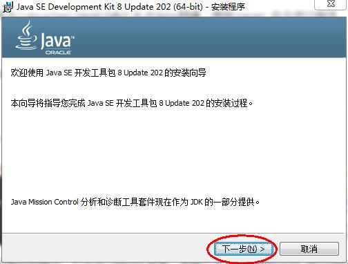

取消独立JRE的安装，单击`公共JRE前的下拉列表`，选择`此功能将不可用`如图所示：


目录结构，如图所示：


## 3. 配置环境变量

配置步骤：

打开桌面上的计算机，进入后在左侧找到`计算机`，单击鼠标`右键`，选择`属性`，如图所示：


选择`高级系统设置`，如图所示：


在`高级`选项卡，单击`环境变量`，如图所示：


在`系统变量`中，单击`新建` ，创建新的环境变量，如图所示：

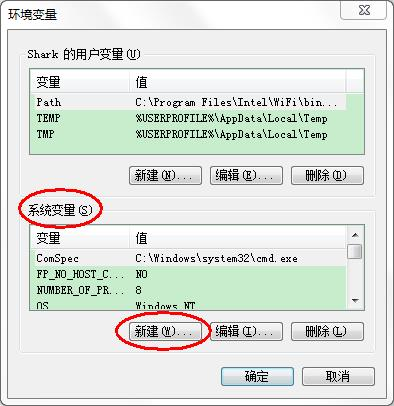

变量名输入`JAVA_HOME`，找到你的jdk目录并单击`确定`，如图所示：


选中`Path` 环境变选中`Path` 环境变量，`双击`或者`点击编辑` ,如图所示：


找到jdk下面的bin目录，然后点击确定**或者**在变量值的最前面，键入`%JAVA_HOME%\bin;`  分号必须要写，而且还要是**英文符号**。如图所示：


环境变量配置完成，**重新开启**DOS命令行，在任意目录下输入`javac` 命令，运行成功：


# 三、IntelliJ IDEA环境部署

## 1. IntelliJ IDEA介绍

IDEA，全称 IntelliJ IDEA，是 Java 语言的集成开发环境，IDEA 在业界被公认为是最好的 java 开发工具之一，尤其在智能代码助手、代码自动提示、重构、J2EE支持、Ant、JUnit、CVS 整合、代码审查、创新 GUI 设计等方面的功能可以说是超常的。

IntelliJ IDEA 主要用于支持 Java、Scala、Groovy 等语言的开发工具，同时具备支持目前主流的技术和框架，擅长于企业应用、移动应用和 Web 应用的开发。IntelliJ IDEA 是为在各个方面最大化提高开发者生产力的而设计的。同时强大的静态代码分析和人机工程学设计使开发不仅高效，而且令人愉快。IntelliJ IDEA 是为在各个方面最大化提高开发者生产力的而设计的。同时强大的静态代码分析和人机工程学设计使开发不仅高效，而且令人愉快。

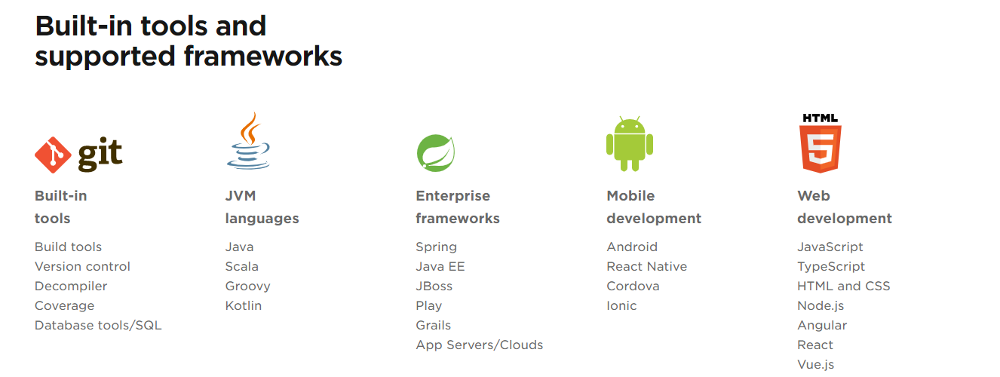

## 2. IDEA的下载

下载网址： https://www.jetbrains.com/idea/download/#section=windows 

IDEA 分为两个版本： 旗舰版(Ultimate)和 社区版(Community)。


两个不同版本的详细对比，可以参照官网： https://www.jetbrains.com/idea/features/editions_comparison_matrix.html

官网提供的详细使用文档： https://www.jetbrains.com/help/idea/meet-intellij-idea.html

如果不想下载，可以登陆我的网盘下载：链接: https://pan.baidu.com/s/1xjo3NVSkE9v137nEw2r5Ig 提取码: 3bgg

## 3. IDEA的安装

双击下载好的安装包（ideaIU-Ultimate-2019.2.3.exe）

欢迎安装：


是否删除电脑上低版本的IDEA：


选择安装目录：


确认操作系统类型，确认是否与.java、.groovy、.kt 格式文件进行关联，这里也可以选择不关联：


在【开始】菜单新建一个文件夹，来管理IDEA的相关内容：

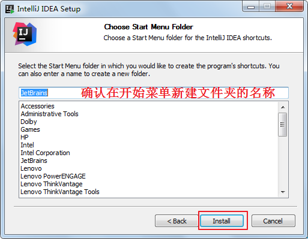


完成安装：

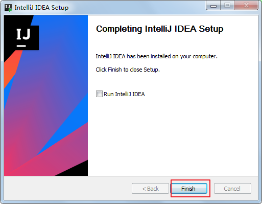

## 4. IDEA的激活

双击

是否导入之前版本的配置：

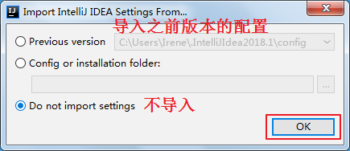

启动界面：


选择UI界面的主题：


激活：


## 5. IDEA的卸载

在【控制面板】找到【卸载程序】：


双击IntelliJ IDEA 2019.2.3进行卸载：


## 6. 新建HelloWorld项目

创建项目：


创建Java项目：


指定项目名称和代码存储目录：


关闭提示：


完成项目创建：


新建Java类：


编写代码：

```java
public class HelloWorld {
    public static void main(String[] args) {
        System.out.println("Hello World!");
    }
}
```

运行：


## 7. IDEA基本配置

显示工具栏：


选择详细配置菜单和按钮：


动提示功能设置：

IntelliJ IDEA 的代码提示和补充功能有一个特性：区分大小写。区分大小写的情况是这样的：比如我们在 Java 代码文件中输入 system，IntelliJ IDEA 默认是不会帮我们提示或是代码补充的，但是如果我们输入System 就可以进行代码提示和补充。 如果想不区分大小写的话，就把这个对勾去掉。


取消自动更新：


## 8. 配置目录

### 8.1. 配置目录介绍

启动后会在C盘的用户目录下生成如下两个目录，例如：C:\Users\Irene.IntelliJIdea2019.2

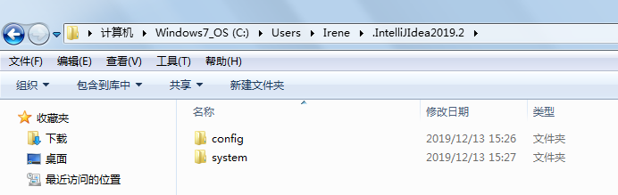

这是 IDEA 的各种配置的保存目录。这个设置目录有一个特性，就是你删除掉整个目录之后，重新启动 IntelliJ IDEA 会再自动帮你生成一个全新的默认配置，所以很多时候如果你把 IntelliJ IDEA 配置改坏了，没关系，删掉该目录，一切都会还原到默认。

config 目录是 IntelliJ IDEA 个性化化配置目录，或者说是整个 IDE 设置目录。此目录可看成是最重要的目录，没有之一，如果你还记得安装篇的介绍的时候，安装新版本的 IntelliJ IDEA 会自动扫描硬盘上的旧配置目录，指的就是该目录。这个目录主要记录了：IDE 主要配置功能、自定义的代码模板、自定义的文件模板、自定义的快捷键、Project 的 tasks 记录等等个性化的设置。

system 目录是 IntelliJ IDEA 系统文件目录，是 IntelliJ IDEA 与开发项目一个桥梁目录，里面主要有：缓存、索引、容器文件输出等等，虽然不是最重要目录，但也是最不可或缺的目录之一。	

### 8.2. 运行内存大小配置

找到IDEA安装目录的bin目录例如：D:\ProgramFiles\JetBrains\IntelliJ_IDEA_2019.2.3\bin，找到idea64.exe.vmoptions文件，用文本编辑器打开：


```properties
* 大家根据电脑系统的位数，选择 32 位的 VM 配置文件或者 64 位的 VM 配置文件
* 32 位操作系统内存不会超过 4G，所以没有多大空间可以调整，建议不用调整了
* 64 位操作系统中 8G 内存以下的机子或是静态页面开发者是无需修改的。
* 64 位操作系统且内存大于 8G 的，如果你是开发大型项目、Java 项目或是 Android 项目，建议进行修改，常修改的就是下面 3 个参数：
```


```properties
*Xms128m
  如果16 G 内存的机器可尝试设置为 -Xms512m(设置初始的内存数，增加该值可以提高 Java 程序的启动速度。)
*Xmx750m
   如果16 G 内存的机器可尝试设置为 -Xmx1500m(设置最大内存数，提高该值，可以减少内存 Garage 收集的频率，提高程序性能)
*XX:ReservedCodeCacheSize=240m
  如果16G 内存的机器可尝试设置为-XX:ReservedCodeCacheSize=500m(保留代码占用的内存容量)
```


# 第二章    面向对象的JavaSE项目


# 一、面向对象思想概述

## 1. 概述

Java语言是一种面向对象的程序设计语言，而面向对象思想（OOP）是一种程序设计思想，我们在面向对象思想的指引下，使用Java语言去设计、开发计算机程序。这里的**对象**泛指现实中一切事物，每种事物都具备自己的**属性**和**行为**。面向对象思想就是在计算机程序设计过程中，参照现实中事物，将事物的属性特征、行为特征抽象出来，描述成计算机事件的设计思想。它区别于面向过程思想（POP），强调的是通过调用对象的行为来实现功能，而不是自己一步一步的去操作实现。

## 2. 面向对象与面向过程的区别

面向过程：POP: Process-Oriented Programming

1）以函数（方法）为最小单位

2）数据独立于函数之外

3）以过程，步骤为主，考虑怎么做

面向对象：OOP: Object Oriented Programming

1）以类/对象为最小单位，类包括：数据+方法

2）以对象（谁）为主，考虑谁来做，谁能做	

程序员的角色：

1）面向过程：程序员是具体执行者

2）面向对象：程序员是指挥者

**注意**：面向对象仍然包含面向过程，只不过关注点变了，关注谁来做。面向对象思想是一种更符合我们思考习惯的思想，它可以将复杂的事情简单化，并将我们从执行者变成了指挥者。

## 3. 面向对象基本特征

面向对象的语言中，包含了三大基本特征，即封装、继承和多态。


# 二、JavaSE项目与模块操作

## 1. 模块概念

在 IntelliJ IDEA 中Project是最顶级的结构单元，然后就是Module，一个Project可以有多个Module。目前，主流的大型项目结构基本都是多Module的结构，这类项目一般是按功能划分的，比如：user-core-module、user-facade-module和user-hessian-module等等，模块之间彼此可以相互依赖。通过这些Module的命名可以看出，它们都是处于同一个项目中的模块，彼此之间是有着不可分割的业务关系。因此，我们可以大致总结出：一个Project是由一个或多个Module组成。

1）当为单Module项目的时候，这个单独的Module实际上就是一个Project；

2）当为多Module项目的时候，多个模块处于同一个Project之中，此时彼此之间具有互相依赖的关联关系；

3）当然多个模块没有建立依赖关系的话，也可以作为单独一个“小项目”运行。


此外， IntelliJ IDEA 的Project是一个不具备任何编码设置、构建等开发功能的概念，其主要作用就是起到一个项目定义、范围约束、规范类型的效果，或许，我们也可以简单地理解Project就是一个单纯的目录，只是这个目录在命名上必须有其代表性的意义。在缺省情况下，IntelliJ IDEA 是默认单Project单Module的，这时Project和Module合二为一，在没有修改存储路径的时候，显然Project对Module具有强约束作用！不过说实话，这里就是将Module的内容放在了Project的目录下，实际上还是Module自己约束自己。

## 2. 创建一个项目

创建一个新项目：


创建Java项目：


完成创建：


## 3. 创建模块

选择创建模块：


选择模块类型:这里选择创建Java模块：


给模块命名：

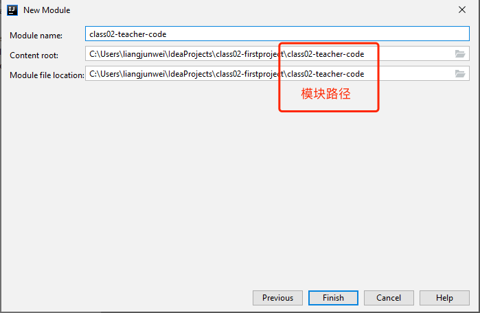

## 4. 删除模块

先从项目中remove：


彻底删除模块：


## 5. 模块依赖

一个模块可以理解为相当于一个独立的小项目，但是它又区别于独立的项目，因为它们同属于一个工程，而且互相之间可以相互依赖，即一个模块可以使用另一个模块的类型。

例如：在class02-teacher-code02模块中需要使用class02-teacher-code01模块中的所有公共类，例如：Student类，可以通过如下操作。在Student stu = new Student();行按Alt +Enter，根据提示，点击Add dependency on module 'class02-teacher-code01'：


如上操作会在class02-teacher-code02.iml文件中增加如下代码，表示依赖于class02-teacher-code01模块。此时class02-teacher-code01模块下所有公共的类在class02-teacher-code02模块下都可以使用了：


## 6. 导入模块

当想要在当前项目中导入一个已存在的模块时，可以进行如下操作。

1）将要导入的模块：


2）拷贝到项目目录中：


3）在项目的modules.xml文件中加入如下配置即可：


4）如果新导入的模块中有依赖相应的库，必须确保对应的库在项目中能找到，否则会报错

5）如果新导入的模块对其他模块有依赖，那么被依赖的模块也得导入

## 7.Debug调试

### 7.1. 启动Debug

在所有调试中，调试一个Java程序是最简单的，主要有设置断点、启动调试、单步执行、结束调试几步。

设置断点：在源代码文件中，在想要设置断点的代码行的前面的标记行处，单击鼠标左键就可以设置断点，在相同位置再次单击即可取消断点：

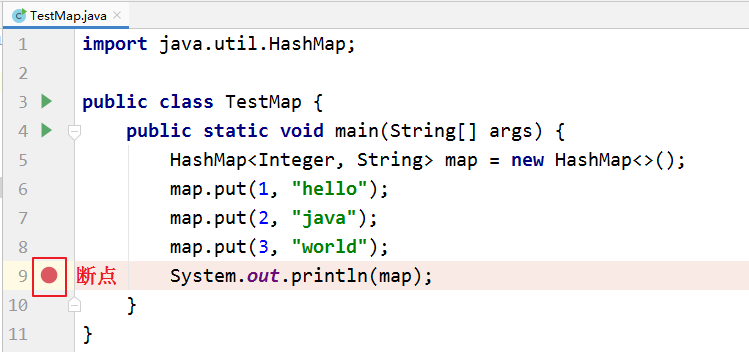

启动调试：IDEA提供多种方式来启动程序(Launch)的调试，分别是通过菜单(Run –> Debug)、图标（“绿色臭虫”)等等：


### 7.2. 单步调试工具介绍

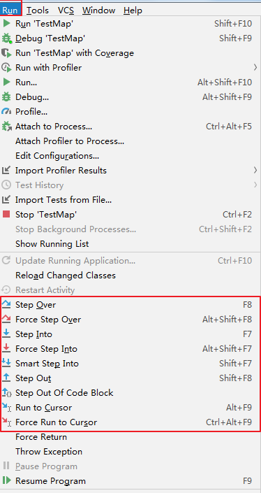

或


：Step Over（F8)：进入下一步，如果当前行断点是调用一个方法，则不进入当前方法体内

：Step Into（F7)：进入下一步，如果当前行断点是调用一个自定义方法，则进入该方法体内

：Force Step Into（Alt +Shift  + F7)：进入下一步，如果当前行断点是调用一个核心类库方法，则进入该方法体内

：Step Out（Shift  + F8)：跳出当前方法体

：Run to Cursor（Alt + F9)：直接跳到下一个断点处继续调试

：Resume Program（F9)：恢复程序运行，但如果该断点下面代码还有断点则停在下一个断点上

：Stop（Ctrl + F2)：结束调试

：View Breakpoints（Ctrl + Shift  + F8)：查看所有断点

：Mute Breakpoints：使得当前代码后面所有的断点失效， 一下执行到底 

### 7.3. 自定义调试数据视图


## 8. 缓存和索引清理

IntelliJ IDEA 首次加载项目的时候，都会创建索引，而创建索引的时间跟项目的文件多少成正比。

在 IntelliJ IDEA 创建索引过程中即使你编辑了代码也是编译不了、运行不起来的，所以还是安安静静等 IntelliJ IDEA 创建索引完成。

IntelliJ IDEA 的缓存和索引主要是用来加快文件查询，从而加快各种查找、代码提示等操作的速度，所以 IntelliJ IDEA 的索引的重要性再强调一次也不为过。

但是，IntelliJ IDEA 的索引和缓存并不是一直会良好地支持 IntelliJ IDEA 的，某些特殊条件下，IntelliJ IDEA 的缓存和索引文件也是会损坏的，比如：断电、蓝屏引起的强制关机，当你重新打开 IntelliJ IDEA，很可能 IntelliJ IDEA 会报各种莫名其妙错误，甚至项目打不开，IntelliJ IDEA 主题还原成默认状态。即使没有断电、蓝屏，也会有莫名奇怪的问题的时候，也很有可能是 IntelliJ IDEA 缓存和索引出现了问题，这种情况还不少。遇到此类问题也不用过多担心。我们可以清理缓存和索引。如下：


1）一般建议点击 Invalidate and Restart，这样会比较干净。

2）上图警告：清除索引和缓存会使得 IntelliJ IDEA 的 Local History 丢失。**所以如果你项目没有加入到版本控制，那你最好备份下你的 LocalHistory 目录**。LocalHistory 目录在用户目录下，例如：C:\Users\Irene.IntelliJIdea2019.2\system。

3）通过上面方式清除缓存、索引本质也就是去删除 C 盘下的 system 目录下的对应的文件而已，所以如果你不用上述方法也可以手动删除整个 system。当 IntelliJ IDEA 再次启动项目的时候会重新创建新的 system 目录以及对应项目缓存和索引。

## 9. 导出Jar

单击工具栏的打开项目设置。

选择Artifacts（打包部署），选择添加jar：


给导出的jar命名，确认导出的路径。确认创建或选择已有的Manifest.MF文件。单词“manifest”的意思是“显示” 。 这个 manifest 文件定义了与扩展和包相关的数据：


**说明**： 打开Java的JAR文件我们经常可以看到文件中包含着一个META-INF目录，这个目录下会有一些文件，其中必有一个MANIFEST.MF，这个文件描述了该Jar文件的很多信息。

选择Manifest.MF文件存储目录：


如果需要可以填写jar的运行入口，main所在的类的全名称：（可选）


选择jar要包含的.class文件的目录：


编译生成jar：


查看生成的jar：


# 三、第三方框架和组件导入（以JUnit4框架为例）

## 1. Maven仓库导入

在@Test后面按Alt + 回车，选择Add 'JUnit4' to classpath即可：


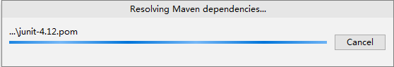

添加完成之后，在External Libraries中可以见到JUnit：


**注意**：如果Maven的本地仓库（例如：C:\Users\Irene\.m2）中没有对应的library则需要联网从Maven的中央仓库中下载或从其他人那里拷贝对应的库。否则会报错：


## 2. 指定本地Jar目录

如果目前无法联网，也无法拷贝对应maven仓库目录，但是你有JUnit的需要的jar包，那么也可以用如下方式指定：

将JUnit框架需要用到的jar包拷贝到当前项目（或模块）的libs目录中（没有libs目录的可以手动创建）：


然后在项目代码中就可以使用JUnit了：


如果此时其他模块也想使用刚才添加的library怎么办？

例如：模块class02-teacher-code02想要使用刚才的JUnit的library，可以单击工具栏的打开项目设置:


**注意Scope**：选择Complie，否则编译时，无法使用JUnit。

查看Class01模块的配置文件Class01.iml，发现多了一句配置。现在Class01模块中也可以使用JUnit了。


# 第三章    JavaSE基础元素与数组


# 一、Java基础元素

## 1. Java的注释

单行注释

```java
//注释的内容
```

多行注释

```java
/*
  注释内容
*/
```

> **注意**：多行注释不能嵌套

文档注释


```java
/**
 文档注释内容
*/
```

## 2. 关键字

关键字：50个，**系统保留字**。


## 3. 标识符

标识符：凡是**代码中自己命名的部分**，例如：类名，变量名等

标识符的命名规则：

1）由26个英文字母大小写，数字0-9，下划线_，美元符号$

2）数字不能开头

3）不能直接使用关键字和保留字、特殊值

4）严格区分大小写

5）不能包含空格

标识符的命名规范：

1）见名知意

2）项目名、模块名：每个单词之间用“-”分割，xx-XXX-xx

2）类名、接口名：每一个单词的首字母大写，XxxYyyZzz

3）变量名、方法名：从第二个单词开始首字母大写，xxxYyyZzz

4）包名：所有单词都小写，每个单词使用.分割，xxx.yyy.zzz

5）常量名：所有字母都大写，每个单词之间使用_分割，XXX_YYY_ZZZ

## 4. 常量与变量

### 4.1. 常量

常量：在程序执行的过程中，其值不可以发生改变的量

常量的分类：

1）**自定义常量**：通过final关键字定义（后面在面向对象部分讲解）

2）**字面值常量**：

| 字面值常量 |      举例      |
| :--------: | :------------: |
| 字符串常量 |  ”HelloWorld“  |
|  整数常量  |    12，-23     |
|  浮点常量  |     12.34      |
|  字符常量  | ‘a’，'0'，‘我’ |
|  布尔常量  |  true，false   |
|   空常量   |      null      |

### 4.2. 变量

**变量**：用来存储数据的，代表内存的一块区域

**变量的三要素**：

1）数据类型

2）变量名

3）变量值

如何声明/定义变量？

```java
数据类型 变量名;
```

变量的赋值：

```java
变量名 = 变量值;
```

变量使用的四个要求：

1）先声明/定义后使用

2）不能重复声明

3）在使用之前必须先初始化

4）变量有作用域

## 5. 数据类型

### 5.1. 数据类型分类

1）**基础数据类型**

- 整型：byte、short、int、long；特殊：在long类型的数字后面加L或l
- 浮点型：float、double；特殊：在float类型的数字后面加F或f
- 字符型：char；特殊：需要使用单引号
- 布尔型：boolean；特殊：只有两个值true和false

2）**引用数据类型**

- 例如：String，自定义类、接口，枚举，数组，...


### 5.2. 数据类型表示范围

1）byte

- 占的内存：1个字节
- 范围：-128~127

2）short

- 占的内存：2个字节
- 范围：-32768~32767

3）int

- 占的内存：4个字节
- 范围：-2的31次方 ~ 2的31次-1

4）long

- 占的内存：8个字节
- 范围：-2的63次方 ~ 2的63次-1
- 某个常量数字要表示为long类型，在数字后面加L

5）float

- 占的内存：4个字节
- 精度范围：科学记数法小数点后7~8位
- 某个常量数字要表示为float类型，在数字后面加F或f

6）double

- 占的内存：8个字节
- 精度范围：科学记数法小数点后15~16位

7）char

- 占的内存：2个字节
- 字符编码范围：0~65535
- 使用的是Unicode字符集
- 程序中有三种字符表示方式：
  - 单引号中加单个字符：'a','尚'
  - 单引号中加转义字符：\n,\t,\r,\b,\,',"
  - 单引号中加编码值：\u5c1a'

8）boolean

- 两个值：true和false
- 实际上底层是使用1表示true，0表示false

### 5.3. 基本数据类型转换

1）自动类型转换


- 当我们把存储范围或精度范围小的赋值给存储范围或精度范围大的变量时
- 当我们把存储范围或精度范围小的与存储范围或精度范围大的类型一起运算时
- 当两个byte,short,char它们的运算会升级为int
- 当与String进行拼接“+”运算，结果都是String

2）强制类型转换

- 格式：(需要强制为的类型)值/变量
- 当我们把存储范围或精度范围大的赋值给存储范围或精度范围小的变量时（这种强制类型转换有风险，可能溢出或损失精度）
- 故意提升某个变量/值的类型，也可以使用强制类型转换
- 无论是自动类型转换还是强制类型转换：boolean不参与

## 6. 两种输出

输出并换行

```java
System.out.println();
System.out.println(xx);
```

输出不换行

```java
System.out.print(xx);
```

## 7. 运算符

### 7.1. 算术运算符

1）加：+

2）减：-

3）乘：*

4）除：/

5）模/取余：%

6）正号：+

7）负号：-

8）自增：++

9）自减：--

### 7.2. 赋值运算符

基本赋值运算符：=

扩展赋值运算符：+=，-=，*=，/=,%=，>>=，<<=，&=....

> **注意**：无论是基本赋值运算符还是扩展赋值运算符都是最后算，并且是把右边的计算的结果最后赋值给左边的变量，即左边一定是一个变量

```java
byte b1 = 1;
byte b2 = 2;
byte b3 = b1 + b2;//编译错
b1 +=  b2;//编译通过
```

### 7.3. 关系运算符/比较运算符

1）大于：>

2）小于：<

3）大于等于：>=

4）小于等于：<=

5）等于：==

6）不等于：!=

> **注意**：所有比较运算符的结果都是true/false，所以比较运算符通常用作条件判断

### 7.4. 逻辑运算符

1）逻辑与：&

2）逻辑或：|

3）逻辑非：!

4）逻辑异或：^

5）短路与：&&

6）短路或：||

> **注意**：逻辑运算符的操作数必须是boolean类型

### 7.5 条件运算符/三元运算符

格式：条件表达式 ? 结果表达式1 : 结果表达式2

当条件表达式为true时，就取结果表达式1的值，否则取结果表达式2的值

### 7.6 位运算符

1）左移：<<

2）右移：>>

3）无符号右移：>>>

4）按位与：&

5）按位或：|

6）按位异或：^

7）按位取反：~

> **注意**：当左移、右移、无符号右移要移动的位数超过数据类型的总位数，那么会出现循环，当你移的位数没有超过数据类型的总位数时，不会出现循环。这里要注意，byte,short,char在移位时，按照int类型处理。

### 7.7 运算符优先级

大体上：()等 > 算术运算符 > 位运算符 > 比较运算符 > 逻辑运算符 > 条件运算符 > 赋值运算符

自己写的原则：尽量不要太复杂，保证可读性

## 8. 初识修饰符

修饰符主要分为：**访问修饰符**和**非访问修饰符**

1）访问修饰符：

- 访问修饰符用来定义类、方法或者变量的访问范围，通常放在语句的最前端。


- 包括：default、private、public、protected

2）非访问修饰符：

- 为了实现一些其他的功能，Java 也提供了许多非访问修饰符。

- 包括：static、final、abstract、synchronized等

> **注意**：此处我们仅给出一个简单的修饰符概念，其详细情况会在后续章节讨论。


# 二、流程控制语句

流程控制语句结构分为：i）顺序结构；ii）分支结构；iii）循环结构

## 1. 顺序结构

特点：依次从上往下顺序执行

```java
//1、准备键盘输入的变量java.util.Scanner input = new java.util.Scanner(System.in);//2、提示输入System.out.print("姓名：");String name = input.next();System.out.print("年龄：");int age = input.nextInt();System.out.print("体重：");double weight = input.nextDouble();System.out.print("性别：");char gender = input.next().charAt(0);System.out.print("是否已婚(true/false)：");boolean marry = input.nextBoolean();
```

## 2. 分支结构

单分支条件判断

```java
if(条件表达式){  语句块;}
```

双分支条件判断

```java
if(条件表达式){  语句块1;}else{  语句块2;}
```

多分支条件判断

```java
if(条件表达式1){  语句块1;}else if(条件表达式2){  语句块2;}else if(条件表达式2){  语句块2;}
```

嵌套

在任意一个if的{}或者else的{}中都可以再嵌套任意一种分支结构。执行原则：如果嵌套在if的{}中，当外面的if条件满足时，才会看里面的分支结构；如果嵌套在else的{}中，当外面的if条件不满足时，才会进入else里面的分支结构。

## 3. 选择结构

```java
switch(表达式){case 常量值1:  语句块1;  【break;】case 常量值2：  语句块2;  【break;】....default:  语句块n+1;  【break;】}
```

## 4. 循环结构

while循环

```java
while(循环条件){  循环体语句块;}
```

do...while循环

```java
do{  循环体语句块;}while(循环条件);
```

for循环

```java
for(;;){  循环体语句块;}
```

跳转

1）break: 用于switch，表示结束当前switch；用于循环，表示结束当前循环。(**说明**：如果break在嵌套循环的内循环中，只能结束内循环。)

2）continue: 用于循环，表示提前结束本次循环，同时跳过本次循环剩下的循环体语句块，提前进入迭代。


# 三、数组

## 1. 数组的概念

数组就是用于存储数据的长度固定的容器，保证多个数据的数据类型要一致。

所谓**数组**(array)，就是相同数据类型的元素按一定顺序排列的集合，就是把有限个类型相同的变量用一个名字命名，以便统一管理他们，然后用编号区分他们，这个名字称为**数组名**，编号称为**下标或索引**(index)。组成数组的各个变量称为数组的**元素**(element)。数组中元素的个数称为**数组的长度**(length)。


数组的特点：

1）数组的长度一旦确定就不能修改

2）创建数组时会在内存中开辟一整块连续的空间。

3）存取元素的速度快，因为可以通过[下标]，直接定位到任意一个元素。

## 2. 数组声明与初始化

**数组的声明**：

```java
//推荐元素的数据类型[] 二维数组的名称;//不推荐元素的数据类型  二维数组名[];
```

方式一：静态初始化

```java
数据类型[] 数组名 = {元素1,元素2,元素3...};//必须在一个语句中完成，不能分开两个语句写
```

举例：

```java
int[] arr = {1,2,3,4,5};	//正确int[] arr;arr = {1,2,3,4,5};				//错误
```

方式二：静态初始化

```java
 数组存储元素的数据类型[] 数组名字 = new 数组存储元素的数据类型[长度]; //或 数组存储元素的数据类型[] 数组名字; 数组名字 = new 数组存储元素的数据类型[长度];
```

举例：定义存储1，2，3，4，5整数的数组容器

```java
int[] arr = new int[]{1,2,3,4,5};	//正确int[] arr;arr = new int[]{1,2,3,4,5};				//正确int[] arr = new int[5]{1,2,3,4,5};//错误的，后面有{}指定元素列表，就不需要在[长度]指定长度。
```

方式三：动态初始化

```java
数组存储的元素的数据类型[] 数组名字 = new 数组存储的元素的数据类型[长度];//或数组存储的数据类型[] 数组名字;数组名字 = new 数组存储的数据类型[长度];
```

举例：定义可以存储5个整数的数组容器

```java
int[] arr = new int[5];int[] arr;arr = new int[5];
```

## 3. 数组元素的访问

**索引：** 每一个存储到数组的元素，都会自动的拥有一个编号，从0开始，这个自动编号称为**数组索引(index)**，可以通过数组的索引访问到数组中的元素。

**索引范围：**[0, 数组的长度-1]

**格式：**

```java
数组名[索引]
```

**索引访问数组中的元素：**

1）数组名[索引]=数值，为数组中的元素赋值

2）变量=数组名[索引]，获取出数组中的元素

```java
public static void main(String[] args) {    //定义存储int类型数组，赋值元素1，2，3，4，5    int[] arr = {1,2,3,4,5};    //为0索引元素赋值为6    arr[0] = 6;    //获取数组0索引上的元素    int i = arr[0];    System.out.println(i);    //直接输出数组0索引元素    System.out.println(arr[0]);}
```

## 4. 数组的遍历

**数组的长度属性：** 每个数组都具有长度，而且是固定的，Java中赋予了数组的一个属性，可以获取到数组的长度，语句为：`数组名.length` ，属性length的执行结果是数组的长度，int类型结果。由次可以推断出，数组的最大索引值为`数组名.length-1`。

**数组遍历：** 就是将数组中的每个元素分别获取出来，就是遍历。遍历也是数组操作中的基石。

```java
public static void main(String[] args) {  	int[] arr = new int[]{1,2,3,4,5};  	//打印数组的属性，输出结果是5  	System.out.println("数组的长度：" + arr.length);        //遍历输出数组中的元素    System.out.println("数组的元素有：");    for(int i=0; i<arr.length; i++){        System.out.println(arr[i]);    }}
```

## 5. 二维数组

二维数组：本质上就是元素为一维数组的一个数组。

二维数组的标记：

```java
int[][] arr; //arr是一个二维数组，可以看成元素是int[]一维数组类型的一个数组
```

二维数组也可以看成一个二维表，行*列组成的二维表，只不过这个二维表，每一行的列数还可能不同。但是每一个单元格中的元素的数据类型是一致的，例如：都是int，都是String等。


### 5.1. 二维数组的声明与初始化

```java
//推荐元素的数据类型[][] 二维数组的名称;//不推荐元素的数据类型  二维数组名[][];//不推荐元素的数据类型[]  二维数组名[];
```

静态初始化

```java
元素的数据类型[][] 二维数组名 = new 元素的数据类型[][]{			{元素1，元素2，元素3 。。。}, 			{第二行的值列表},			...			{第n行的值列表}		};元素的数据类型[][] 二维数组名;二维数组名 = new 元素的数据类型[][]{			{元素1，元素2，元素3 。。。}, 			{第二行的值列表},			...			{第n行的值列表}		};		//以下格式要求声明与静态初始化必须一起完成元素的数据类型[][] 二维数组的名称 = {			{元素1，元素2，元素3 。。。}, 			{第二行的值列表},			...			{第n行的值列表}		};
```

> **注意**：如果是静态初始化，右边new 数据类型[][]中不能写数字，因为行数和列数，由{}的元素个数决定。

举例：

```java
int[][] arr;arr = new int[][]{{1,2,3},{4,5,6},{7,8,9}};arr = new int[3][3]{{1,2,3},{4,5,6},{7,8,9}};//错误，静态初始化右边new 数据类型[]中不能写数字int[][] arr = new int[][]{{1,2,3},{4,5,6},{7,8,9}};int[][] arr = {{1,2,3},{4,5,6},{7,8,9}};			//声明与初始化必须在一句完成
```

```java
public class Array2Demo1 {	public static void main(String[] args) {		//定义数组		int[][] arr = {{1,2,3},{4,5},{6}};				System.out.println(arr);		System.out.println(arr[0]);		System.out.println(arr[1]);		System.out.println(arr[2]);				System.out.println(arr[0][0]); //1		System.out.println(arr[1][0]); //4		System.out.println(arr[2][0]); //6				System.out.println(arr[0][1]); //2		System.out.println(arr[1][1]); //5		//越界		System.out.println(arr[2][1]); //错误	}}
```

动态初始化（规则二维表：每一行的列数是相同的）

```java
//（1）确定行数和列数元素的数据类型[][] 二维数组名 = new 元素的数据类型[m][n];	m:表示这个二维数组有多少个一维数组。或者说一共二维表有几行	n:表示每一个一维数组的元素有多少个。或者说每一行共有一个单元格//此时创建完数组，行数、列数确定，而且元素也都有默认值//（2）再为元素赋新值二维数组名[行下标][列下标] = 值;
```

```java
public static void main(String[] args) {    //定义一个二维数组    int[][] arr = new int[3][2];        //定义了一个二维数组arr    //这个二维数组有3个一维数组的元素    //每一个一维数组有2个元素    //输出二维数组名称    System.out.println(arr); //地址值	[[I@175078b        //输出二维数组的第一个元素一维数组的名称    System.out.println(arr[0]); //地址值	[I@42552c    System.out.println(arr[1]); //地址值	[I@e5bbd6    System.out.println(arr[2]); //地址值	[I@8ee016        //输出二维数组的元素    System.out.println(arr[0][0]); //0    System.out.println(arr[0][1]); //0        //...}	 
```

动态初始化（不规则：每一行的列数可能不一样）

```java
//（1）先确定总行数元素的数据类型[][] 二维数组名 = new 元素的数据类型[总行数][];//此时只是确定了总行数，每一行里面现在是null//（2）再确定每一行的列数，创建每一行的一维数组二维数组名[行下标] = new 元素的数据类型[该行的总列数];//此时已经new完的行的元素就有默认值了，没有new的行还是null//(3)再为元素赋值二维数组名[行下标][列下标] = 值;
```

```java
	public static void main(String[] args) {		//定义数组		int[][] arr = new int[3][];    System.out.println(arr);	//[[I@175078b    System.out.println(arr[1][0]);//NullPointerException		System.out.println(arr[0]); //null		System.out.println(arr[1]); //null		System.out.println(arr[2]); //null				//动态的为每一个一维数组分配空间		arr[0] = new int[2];		arr[1] = new int[3];		arr[2] = new int[1];				System.out.println(arr[0]); //[I@42552c		System.out.println(arr[1]); //[I@e5bbd6		System.out.println(arr[2]); //[I@8ee016				System.out.println(arr[0][0]); //0		System.out.println(arr[0][1]); //0		//ArrayIndexOutOfBoundsException		//System.out.println(arr[0][2]); //错误				arr[1][0] = 100;		arr[1][2] = 200;	}
```

### 5.2. 二维数组的相关名称及其表示方式

二维数组的长度/行数： 二维数组名.length

二维数组的某一行：二维数组名[行下标]；行下标的范围：[0, 二维数组名.length-1]

某一行的列数：二维数组名[行下标].length

某一个元素：二维数组名[行下标][列下标]

### 5.3. 二维数组的遍历

```java
for(int i=0; i<二维数组名.length; i++){    for(int j=0; j<二维数组名[i].length; j++){        System.out.print(二维数组名[i][j]);    }    System.out.println();}
```


# 第四章    类与对象、枚举、接口


# 一、类与对象（一）：成员变量、成员方法、构造器

## 1. 类与对象简介

### 1.1. 什么是类？

**类**：**是一类具有相同特性的事物的抽象**描述，是一组相关**属性**和**行为**的集合。可以看成是一类事物的模板，使用事物的属性特征和行为特征来描述该类事物。

属性：就是该事物的状态信息。

行为：就是该事物能够做什么。

举例：小猫；属性：名字、体重、年龄、颜色；行为：走、跑、叫。	

### 1.2. 什么是对象？

对象：是一类事物的具体体现。对象是类的一个**实例**，必然具备该类事物的属性和行为。

举例：一只小猫 ；属性：tom、5kg、2岁、白色等； 行为：喵喵叫、蹦跶的跑等。

### 1.3. 对象与类的关系

类是对一类事物的描述，是**抽象的**。对象是一类事物的实例，是**具体的**。**类是对象的模板，对象是类的实体**。

 

## 2. 类的定义和对象的创建

### 2.1. 类的定义格式

```java
【修饰符】 class 类名 {
  //成员变量
  //成员方法
  //构造器
}
```

1）定义类：就是定义类的成员，包括**成员变量**和**成员方法**。

2）成员变量：和以前定义变量几乎是一样的。只不过位置发生了改变。**在类中，方法外**。

3）成员方法：和以前写的main方法格式类似。只不过功能和形式更丰富了。在类中，方法外。

类的定义格式举例

```java
public class Person {
    //成员变量
    String name；//姓名
    int age；//年龄
    boolean isMarried;
    //构造器
  	Person(String name, int age, boolean isMarried){
      this.name = name;
      this.age = age;
      this.isMarried = isMarried;
    }
    //成员方法
    public void walk(){
        System.out.println("人走路...");
    }
    public String display(){
        return "名字是：" + name + "，年龄是：" + age + "，Married：" + isMarried;
    }
}
```

### 2.2. 对象的创建

```java
new 类名()//也称为匿名对象

//给创建的对象命名
//或者说，把创建的对象用一个引用数据类型的变量保存起来
类名 对象名 = new 类名();
```

那么，对象名中存储的是什么呢？答：对象地址

```java
class Student{   
}

public class TestStudent{
    //Java程序的入口
    public static void main(String[] args){
        System.out.println(new Student());//Student@7852e922

        Student stu = new Student();
        System.out.println(stu);//Student@4e25154f
        
        int[] arr = new int[5];
		System.out.println(arr);//[I@70dea4e
    }
}
//Student和TestStudent没有位置要求，谁在上面谁在下面都可以
//但是如果TestStudent类的main中使用了Student类，那么要求编译时，这个Student已经写好了，不写是不行的
//如果两个类都在一个.java源文件中，只能有一个类是public的
```

## 3. 成员变量

### 3.1. 成员变量的分类

1）**实例变量**：没有static修饰，也叫对象属性，属于某个对象的，通过对象来使用

2）**类变量**：有static修饰，也叫类变量，属于整个类的，不是属于某个实例

### 3.2. 如何声明成员变量？

```java
【修饰符】 class 类名{
    【修饰符】 数据类型  属性名;    //属性有默认值
    【修饰符】 数据类型  属性名 = 值; //属性有初始值
}
```

**说明**：属性的类型可以是Java的任意类型，包括基本数据类型、引用数据类型（类、接口、数组等）

例如：声明一个中国人的类

```java
class Chinese{
	static String country;
	String name;
  char gender = '男';//显式赋值
}
```

### 3.3. 如何在类外面访问成员变量？

类变量

```java
类名.静态成员变量  //推荐
对象名.静态成员变量 //不推荐
```

实例变量

```java
对象名.普通成员变量  //只能使用这种方式
```

例如：

```java
public class TestChinese {	public static void main(String[] args) {		//类名.静态成员变量		System.out.println(Chinese.country);		//错误，普通成员变量必须通过对象.进行访问		//System.out.println(Chinese.name);		Chinese c1 = new Chinese();		//对象名.普通成员变量		System.out.println(c1.name);		//静态的成员变量也可以通过对象.进行访问		//对象名.普通成员变量		System.out.println(c1.country);        System.out.println(c1.gender);	}}class Chinese{	static String country;	String name;  char gender = '男';}
```

### 3.4. 成员变量的特点

成员变量有默认值

| 基本类型 | 整数（byte，short，int，long） | 0        |
| -------- | ------------------------------ | -------- |
|          | 浮点数（float，double）        | 0.0      |
|          | 字符（char）                   | '\u0000' |
|          | 布尔（boolean）                | false    |
|          | 数据类型                       | 默认值   |
| 引用类型 | 数组，类，接口                 | null     |

类变量的值是所有对象共享的，而实例变量的值是每个对象独立的

```java
public class TestChinese {	public static void main(String[] args) {		Chinese c1 = new Chinese();		Chinese c2 = new Chinese();				c1.name = "张三";		c2.name = "李四";    c2.gender = '女';				//c1.country = "中国";		Chinese.country = "中国";//推荐				System.out.println("c1.country = " + c1.country + ",c1.name = " + c1.name + ",c1.gender = " + c1.gender);		System.out.println("c2.country = " + c2.country + ",c2.name = " + c2.name + ",c2.gender = " + c2.gender);	}	}class Chinese{	static String country;	String name;  char gender = '男';}
```

## 4. 成员方法

### 4.1. 方法概念

方法也叫**函数**，**是一个独立功能的定义**，是一个类中最基本的功能单元。把一个功能封装为方法的目的是，可以实现代码重用，从而简少代码量。

### 4.2. 方法原则

必须先声明后使用，类，变量，方法等都要先声明后使用。

不调用不执行，调用一次执行一次。

### 4.3. 方法分类

1）实例方法：没有static修饰的方法，必须通过实例对象来调用。

2）静态方法：有static修饰的方法，也叫类方法，可以由类名来调用。

### 4.4. 方法声明

方法声明的位置必须在类中方法外

**语法格式**

```java
【修饰符】 返回值类型 方法名(【参数列表：参数类型1 参数名1,参数类型2 参数名, ...... 】){        方法体；        【return 返回值;】}
```

1）修饰符： 修饰符后面一一介绍，例如：public，static等都是修饰符

2）返回值类型： 表示方法运行的结果的数据类型，方法执行后将结果返回到调用者

- 基本数据类型
- 引用数据类型
- 无返回值类型：void

3）方法名：给方法起一个名字，见名知意，能准确代表该方法功能的名字

4）参数列表：方法内部需要用到其他方法中的数据，需要通过参数传递的形式将数据传递过来，可以是基本数据类型、引用数据类型、也可以没有参数，什么都不写

5）方法体：特定功能代码

6）return：结束方法，并将方法的结果返回去，

- 如果返回值类型不是void，方法体中必须保证一定有return 返回值;语句，并且要求该返回值结果的类型与声明的返回值类型一致或兼容。
- 如果返回值类型为void时，return 后面不用跟返回值，甚至也可以没有return语句。
- return语句后面就不能再写其他代码了，否则会报错：Unreachable code

7）声明位置：

```java
类{    方法1(){            }    方法2(){            }}
```

- 错误示例：


```java
类{    方法1(){        方法2(){  //位置错误           		}    }}
```

**示例一**：

声明一个圆的图形类：

属性（成员变量）：半径，

成员方法：求面积的方法，返回圆对象信息的方法

在测试类的main中，创建圆的2个对象，为半径属性赋值，调用两个方法进行测试

提示：圆周率为Math.PI

```java
class Circle{	double radius;	double area() {		return Math.PI * radius * radius;	}}
```

> Circle不同的对象，半径值不同，那么面积也不同，所以这里area()是非静态的

**示例二**：

声明一个计算工具类CountTools：

方法1：求两个整数的最大值

```java
class CountTools{	static int max(int a, int b) {        return a > b ? a : b;	}}
```

> CountTools只是一个工具类，求两个整数最大值的功能，和CountTools对象无关，所以这里max方法声明为静态的更好，当然也可以声明为非静态的，就是调用的时候需要创建CountTools对象而已。

### 4.5. 在其他类中调用方法

实例方法

```java
对象名.普通方法(【实参列表】)  //必须通过对象来访问
```

示例代码：

```java
public class TestCircle {	public static void main(String[] args) {		Circle c1 = new Circle();		c1.radius = 1.2;		System.out.println("c1的面积：" + c1.area());		//普通方法只能通过"对象."进行访问  	//System.out.println("c1的面积：" + Circle.area());		Circle c2 = new Circle();		c2.radius = 2.5;		System.out.println("c2的面积：" + c2.area());	}}class Circle{	double radius;	public double area() {		return Math.PI * radius * radius;	}}
```

类方法

```java
类名.类方法(【实参列表】)  //推荐对象名.类方法(【实参列表】) //不推荐
```

示例：

```java
public class TestCount {	public static void main(String[] args) {		System.out.println(CountTools.max(4, 1));		//静态方法也可以通过“对象.”访问，就是麻烦点		CountTools c = new CountTools();		System.out.println(c.max(2, 5));	}}class CountTools{	static int max(int a, int b) {		return a > b ? a : b;	}}
```


### 4.6. 在本类中调用方法

直接用，不需要加“对象名."和"类名."

**唯一例外**：静态方法中不能直接访问本类的非静态的成员变量和成员方法

```java
class Circle{	double radius;		//写一个方法，可以返回“圆对象”的详细信息	String getDetailInfo(){		return "半径：" + radius + "，面积：" + area() +"，周长：" + perimeter();	}		//写一个方法，可以返回“圆对象”的面积	double area(){		return Math.PI*radius*radius;	}		//写一个方法，可以返回“圆对象”的周长	double perimeter(){		return 2*Math.PI*radius;	}}
```

```java
class Test{			static void test(){		System.out.println("");	}	void method(){		 test();	}      public static void main(String[] args){        method();//错误        test();//正确  }}
```

### 4.7. 方法参数传递

方法的参数传递机制：**实参**给**形参**赋值

方法的形参是基本数据类型时，形参值的改变不会影响实参；

方法的形参是引用数据类型时，形参地址值的改变不会影响实参，但是形参地址值里面的数据的改变会影响实参，例如，修改数组元素的值，或修改对象的属性值。

**注意**：String、Integer等特殊类型容易错

示例代码1：

```java
class Test{    public static void swap(int a, int b){        int temp = a;        a = b;        b = temp;	}	public static void main（String[] args){        int x = 1;        int y = 2;        swap(x,y);//调用完之后，x与y的值不变    }}
```

示例代码2：

```java
class Test{    public static void change(MyData my){        my.num *= 2;    }        public static void main(String[] args){        MyData m = new MyData();        m.num = 1;         change(m);//调用完之后，m对象的num属性值就变为2    }}class MyData{    int num;}
```

示例代码3：

```java
public class Test {	public static void main(String[] args) {		int[] arr = {2,4,1,5,3};				ArrayUtil.sort(arr);				for (int i = 0; i < arr.length; i++) {			System.out.println(arr[i]);		}	}}class ArrayUtil{	public static void sort(int[] arr){		for (int i = 1; i < arr.length; i++) {			for (int j = 0; j < arr.length - i; j++) {				if(arr[j] > arr[j+1]){					int temp = arr[j];					arr[j] = arr[j+1];					arr[j+1] = temp;				}			}		}	}}
```

陷阱1：

```java
/*陷阱1：在方法中，形参 = 新new对象，那么就和实参无关了*/class Test{    public static void change(MyData my){        my = new MyData();//形参指向了新对象        my.num *= 2;    }    public static void main(String[] args){        MyData m = new MyData();        m.num = 1;        change(m);//调用完之后，m对象的num属性值仍然为1    }}class MyData{    int num;}
```

陷阱2：见字符串和包装类部分

```java
public class Test {	public static void main(String[] args) {		StringUtil util = new StringUtil();		String str = "SZIIT";		util.change(str);		System.out.println(str);	}}class StringUtil{	public void change(String str){		str += "你好";//String对象不可变，一旦修改就会产生新对象	}}
```

## 5. 可变参数

在**JDK1.5**之后，如果我们定义一个方法时，此时某个形参的类型可以确定，但是形参的个数不确定，那么我们可以使用可变参数。

格式：

```
【修饰符】 返回值类型 方法名(【非可变参数部分的形参列表,】参数类型... 形参名){  }
```

要求：

1）一个方法最多只能有一个可变参数

2）如果一个方法包含可变参数，那么可变参数必须是形参列表的最后一个

```
【修饰符】 返回值类型 方法名(【非可变参数部分的形参列表,】参数类型[] 形参名){  }
```

只是后面这种定义，在调用时必须传递数组，而前者更灵活，既可以传递数组，又可以直接传递数组的元素，这样更灵活了。

示例：

```java
public class TestString {    public static void main(String[] args) {        StringUtil util = new StringUtil();        String str = "SZIIT";        String[] str1 =  {"how", "are", "you"};        util.change(str, str1);    }}class StringUtil{    public void change(String str, String[] str1){        for(int i=0; i<str1.length; i++){            System.out.println(str1[i]);            System.out.println(str);        }    }}
```

## 6. 方法重载

### 6.1. 重载概念

**方法重载**：指在同一个类中，允许存在一个以上的同名方法，只要它们的参数列表不同即可，与修饰符和返回值类型无关。

参数列表：数据类型个数不同，数据类型不同，数据类型顺序不同。

重载方法调用：JVM通过方法的参数列表，调用不同的方法。

### 6.2. 说明示例

示例一：比较两个数据是否相等

比较两个数据是否相等。参数类型分别为两个`byte`类型，两个`short`类型，两个`int`类型，两个`long`类型，并在`main`方法中进行测试。 

```java
public class Method_Demo6 {    public static void main(String[] args) {        //定义不同数据类型的变量        byte a = 10;        byte b = 20;        short c = 10;        short d = 20;        int e = 10;        int f = 10;        long g = 10;        long h = 20;        // 调用        System.out.println(compare(a, b));        System.out.println(compare(c, d));        System.out.println(compare(e, f));        System.out.println(compare(g, h));    }    // 两个byte类型的    public static boolean compare(byte a, byte b) {        System.out.println("byte");        return a == b;    }    // 两个short类型的    public static boolean compare(short a, short b) {        System.out.println("short");        return a == b;    }    // 两个int类型的    public static boolean compare(int a, int b) {        System.out.println("int");        return a == b;    }    // 两个long类型的    public static boolean compare(long a, long b) {        System.out.println("long");        return a == b;    }}
```

示例二：求各种最大值

用重载实现：
定义方法求两个整数的最大值
定义方法求三个整数的最大值
定义方法求两个小数的最大值

```java
//求两个整数的最大值public int max(int a,int b){    return a>b?a:b;}	//求三个整数的最大值public int max(int a, int b, int c){    return max(max(a,b),c);}	//求两个小数的最大值public double max(double a, double b){    return a>b?a:b;}
```

## 7. 构造器

我们发现我们new完对象时，所有成员变量都是默认值，如果我们需要赋别的值，需要挨个为它们再赋值，太麻烦了。我们能不能在new对象时，直接为当前对象的某个或所有成员变量直接赋值呢。

可以，Java给我们提供了构造器。

### 7.1. 构造器作用

在创建对象的时候为实例变量赋初始值

**注意**：构造器只为实例变量初始化，不为静态类变量初始化

### 7.2. 构造器语法格式

又称为构造方法，那是因为它长的很像方法。但是和方法还有有所区别的。

```java
【修饰符】 构造器名(){    // 实例初始化代码}【修饰符】 构造器名(参数列表){  // 实例初始化代码}
```

代码如下：

```java
public class Student {  private String name;  private int age;    // 无参构造    public Student() {}     // 有参构造    public Student(String name,int age) {    this.name = name;    this.age = age;   }      public String getName() {    return name;  }  public void setName(String name) {    this.name = name;  }  public int getAge() {    return age;  }  public void setAge(int age) {    this.age = age;  }}
```

注意事项：

1）构造器名必须与它所在的类名必须相同。

2）它没有返回值，所以不需要返回值类型，甚至不需要void

3）如果你不提供构造器，系统会给出无参数构造器，并且该构造器的修饰符默认与类的修饰符相同

4）如果你提供了构造器，系统将不再提供无参数构造器，除非你自己定义。

5）构造器是可以重载的，既可以定义参数，也可以不定义参数。

6）构造器的修饰符只能是权限修饰符，不能被其他任何修饰

## 8. Static修饰符

static是一个修饰符，可以修饰：

1）成员变量，我们称为类变量，或静态变量，表示某个类的所有对象共享的数据

2）成员方法，我们称为类方法，或静态方法，表示不需要实例对象就可以调用的方法，使用“类名."进行调用

3）代码块，我们称为静态代码块，或静态初始化块，用于为静态变量初始化，每一个类的静态代码块只会执行一次，在类第一次初始化时执行

4）成员内部类，我们称为静态成员内部类，简称静态内部类，不需要外部类实例对象就可以使用的内部类，在静态内部类中只能使用外部类的静态成员

容易错误：

1）static修饰外部类（错误）

2）static的方法被重写（错误）


# 二、类与对象（二）：封装、权限修饰符、包

## 1. 封装概述

### 1.1. 为什么需要封装？

我要用洗衣机，只需要按一下开关和洗涤模式就可以了。有必要了解洗衣机内部的结构吗？有必要碰电动机吗？我们使用的电脑，内部有CPU、硬盘、键盘、鼠标等等，每一个部件通过某种连接方式一起工作，但是各个部件之间又是独立的。

面向对象编程语言是对客观世界的模拟，客观世界里每一个事物的内部信息都是隐藏在对象内部的，外界无法直接操作和修改，只能通过指定的方式进行访问和修改。封装可以被认为是一个保护屏障，防止该类的代码和数据被其他类随意访问。适当的封装可以让代码更容易理解与维护，也加强了代码的安全性。

随着我们系统越来越复杂，类会越来越多，那么类之间的访问边界必须把握好，面向对象的开发原则要遵循“高内聚、低耦合”，而“高内聚，低耦合”的体现之一：

1）**高内聚**：类的内部数据操作细节自己完成，不允许外部干涉；

2）**低耦合**：仅对外暴露少量的方法用于使用

隐藏对象内部的复杂性，只对外公开简单的接口。便于外界调用，从而提高系统的可扩展性、可维护性。通俗的讲，把该隐藏的隐藏起来，该暴露的暴露出来。这就是封装性的设计思想。

### 1.2. 如何实现封装？

通俗的讲，封装就是把该隐藏的隐藏起来，该暴露的暴露出来。那么暴露的程度如何控制呢？就是依赖**访问控制修饰符**来对**边界**进行控制。

边界有如下：

1）类

2）包

3）子类

4）模块：Java9之后引入

权限修饰符：public、protected、default、private

| 修饰符    | 本类 | 本包 | 其他包子类 | 其他包非子类 | 其他模块                 |
| --------- | ---- | ---- | ---------- | ------------ | ------------------------ |
| private   | √    | ×    | ×          | ×            | ×                        |
| default   | √    | √    | ×          | ×            | ×                        |
| protected | √    | √    | √          | ×            | ×                        |
| public    | √    | √    | √          | √            | 默认不可以，可以建立依赖 |

1）外部类：public和default

2）成员变量：public、protected、default、private

3）成员方法：public、protected、default、private

4）构造器：public、protected、default、private

## 2. 成员变量/函数私有化

**<span style="color:red">成员变量（field）私有化</span>之后，提供标准的<span style="color:red">get/set</span>方法，我们把这种成员变量也称为<span style="color:red">属性（property）</span>。**或者可以说只要能通过get/set操作的就是事物的属性，哪怕它没有对应的成员变量。

### 2.1. 成员变量封装目的

1）隐藏类的实现细节

2）让使用者只能通过事先预定的方法来访问数据，从而可以在该方法里面加入控制逻辑，限制对成员变量的不合理访问。还可以进行数据检查，从而有利于保证对象信息的完整性。

3）便于修改，提高代码的可维护性。主要说的是隐藏的部分，在内部修改了，如果其对外可以的访问方式不变的话，外部根本感觉不到它的修改。

### 2.2. 实现步骤

使用 `private` 修饰成员变量，代码如下：

```java
private 数据类型 变量名 ；
```

```java
public class Chinese {    private static String country;    private String name;  	private int age;    private boolean marry;}
```

提供 `getXxx`方法 / `setXxx` 方法，可以访问成员变量，代码如下：

```java
public class Chinese {  	private static String country;    private String name;  	private int age;    private boolean marry;        public static void setCountry(String c){        country = c;    }        public static String getCountry(){        return country;    }		public void setName(String n) {				name = n;    }    public String getName() {        return name;		}    public void setAge(int a) {        age = a;    }    public int getAge() {        return age;    }        public void setMarry(boolean m){        marry = m;    }        public boolean isMarry(){        return marry;    }}
```

如何解决**局部变量**与**成员变量**同名问题？

1）当局部变量与类变量（静态成员变量）同名时，在类变量前面加“类名."；

2）当局部变量与实例变量（非静态成员变量）同名时，在实例变量前面加“this.”

```java
public class Chinese {  	private static String country;    private String name;  	private int age;        public static void setCountry(String country){        Chinese.country = country;    }        public static String getCountry(){        return country;    }	public void setName(String name) {				this.name = name;    }    public String getName() {        return name;	}    public void setAge(int age) {        this.age = age;    }    public int getAge() {        return age;    }}
```

## 3. 包（Package）

### 3.1. 包的作用

1）可以避免类重名：有了包之后，类的全名称就变为：包.类名

2）分类组织管理众多的类，例如：

- java.lang----包含一些Java语言的核心类，如String、Math、Integer、 System和Thread等，提供常用功能
- java.net----包含执行与网络相关的操作的类和接口。
- java.io ----包含能提供多种输入/输出功能的类。
- java.util----包含一些实用工具类，如集合框架类、日期时间、数组工具类Arrays，文本扫描仪Scanner，随机值产生工具Random。
- java.text----包含了一些java格式化相关的类
- java.sql和javax.sql----包含了java进行JDBC数据库编程的相关类/接口
- java.awt和java.swing----包含了构成抽象窗口工具集（abstract window toolkits）的多个类，这些类被用来构建和管理应用程序的图形用户界面(GUI)。

3）可以控制某些类型或成员的可见范围。如果某个类型或者成员的权限修饰缺省的话，那么就仅限于本包使用。

### 3.2. 声明包的语法格式

#### 3.2.1. 包的声明方式

```
package 包名;
```

> 注意：
>
> 必须在源文件的代码首行
>
> 一个源文件只能有一个声明包的语句

#### 3.2.2. 包的命名规范和习惯：

所有单词都小写，每一个单词之间使用.分割 

习惯用公司的域名倒置

例如：com.drimwai.xxx;

> 建议大家取包名时不要使用“java.xx"包

### 3.3. 如何跨包使用类

#### 3.3.1. 前提

被使用的类或成员的权限修饰符是>缺省的，即可见的

#### 3.3.2. 使用类型的全名称

例如：java.util.Scanner input = new java.util.Scanner(System.in);

#### 3.3.3. 使用import后，代码中使用简名称

import语句告诉编译器到哪里去寻找类。

import语句的语法格式：

```java
import 包.类名;import 包.*;import static 包.类名.静态成员;
```

> 注意：
>
> 使用java.lang包下的类，不需要import语句，就直接可以使用简名称
>
> import语句必须在package下面，class的上面
>
> 当使用两个不同包的同名类时，例如：java.util.Date和java.sql.Date。一个使用全名称，一个使用简名称

#### 3.3.4. 示例代码

```java
package com.drimwaipublic class Student {	// 成员变量	private String name;	private int age;	// 构造方法	public Student() {	}	public Student(String name, int age) {		this.name = name;		this.age = age;	}	// 成员方法	public void setName(String name) {		this.name = name;	}	public String getName() {		return name;	}	public void setAge(int age) {		this.age = age;	}	public int getAge() {		return age;	}}
```

```java
package com.tom;import com.drimwai.Student;public class Test{    public static void main(String[] args){        Student stu = new Student();        stu.setName("tom");        String str = "hello";        System.out.println(str + " " + stu.getName());    }}
```

### 3.4. 标准JavaBean

`JavaBean` 是 Java语言编写类的一种标准规范。符合`JavaBean` 的类，要求：

1）类必须是具体的和公共的，

2）并且具有无参数的构造方法，

3）成员变量私有化，并提供用来操作成员变量的`set` 和`get` 方法。

```java
public class ClassName{  //成员变量      //构造方法    //无参构造方法【必须】    //有参构造方法【建议】      //getXxx()  //setXxx()  //其他成员方法}
```

编写符合`JavaBean` 规范的类，以学生类为例，标准代码如下：	

```java
public class Student {  // 成员变量  private String name;  private int age;  // 构造方法  public Student() {  }  public Student(String name, int age) {    this.name = name;    this.age = age;  }  // get/set成员方法  public void setName(String name) {    this.name = name;  }  public String getName() {    return name;  }  public void setAge(int age) {    this.age = age;  }  public int getAge() {    return age;  }      //其他成员方法列表  public String getInfo(){    return "姓名：" + name + "，年龄：" + age;  }}
```

测试类，代码如下：

```java
public class TestStudent {  public static void main(String[] args) {    //无参构造使用    Student s = new Student();    s.setName("Tom");    s.setAge(18);    System.out.println(s.getName() + "---" + s.getAge());    System.out.println(s.getInfo());    //带参构造使用    Student s2 = new Student("Jason", 18);    System.out.println(s2.getName() + "---" + s2.getAge());    System.out.println(s2.getInfo());  }}
```


# 三、类与对象（三）：继承、final修饰符、this/super关键字

## 1. 继承的概述

继承的由来，如图所示：


多个类中存在相同属性和行为时，将这些内容抽取到单独一个类中，那么多个类中无需再定义这些属性和行为，只需要和抽取出来的类构成某种关系。如图所示：

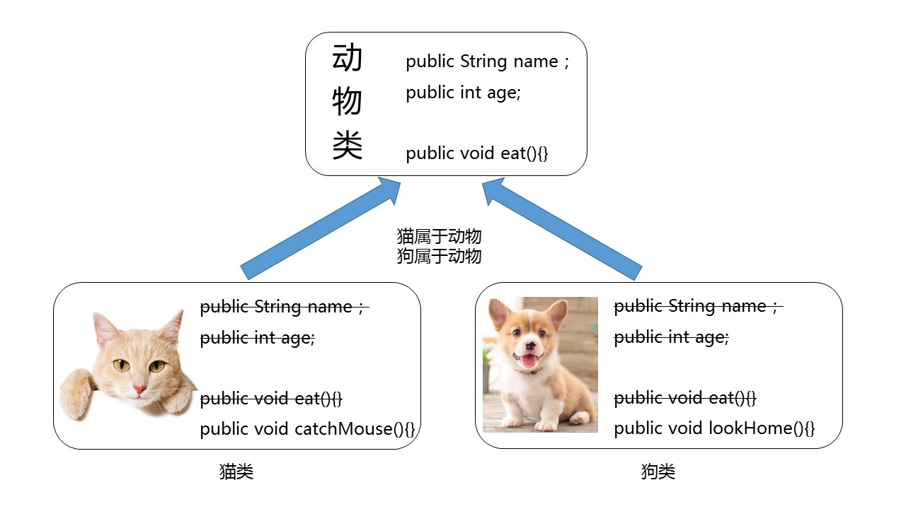

其中，多个类可以称为子类，也叫派生类；多个类抽取出来的这个类称为父类、超类（superclass）或者基类。

继承描述的是事物之间的所属关系，这种关系是：`is-a` 的关系。例如，图中猫属于动物，狗也属于动物。可见，父类更通用，子类更具体。我们通过继承，可以使多种事物之间形成一种关系体系。

**继承的好处有哪些**？

1）提高**代码的复用性**。

2）提高**代码的扩展性**。

3）类与类之间产生了关系，是学习**多态的前提**。

## 2. 继承的格式

通过 `extends` 关键字，可以声明一个子类继承另外一个父类，定义格式如下：

```java
【修饰符】 class 父类 {  ...}【修饰符】 class 子类 extends 父类 {  ...}
```

继承演示，代码如下：

```java
/* * 定义动物类Animal，做为父类 */class Animal {  // 定义name属性  String name;   // 定义age属性  int age;  // 定义动物的吃东西方法  public void eat() {   	 System.out.println(age + "岁的" + name + "在吃东西");  }}/* * 定义猫类Cat 继承 动物类Animal */class Cat extends Animal {  // 定义一个猫抓老鼠的方法catchMouse  public void catchMouse() {   	 System.out.println("抓老鼠");  }}/* * 定义测试类 */public class ExtendDemo01 {  public static void main(String[] args) {    // 创建一个猫类对象    Cat cat = new Cat()；    // 为该猫类对象的name属性进行赋值    cat.name = "Tom";    // 为该猫类对象的age属性进行赋值    cat.age = 2;    // 调用该猫的catchMouse()方法    cat.catchMouse();    // 调用该猫继承来的eat()方法    cat.eat();  }}演示结果：抓老鼠2岁的Tom在吃东西
```

## 3. 继承特点（一）--- 成员变量

### 3.1. 父类成员变量私有化

父类中的成员，无论是公有(public)还是私有(private)，均会被子类继承。

子类虽会继承父类私有(private)的成员，但子类不能对继承的私有成员直接进行访问，可通过继承的get/set方法进行访问。如图所示：


代码如下：

```java
/* * 定义动物类Animal，做为父类 */class Animal {  // 定义name属性  private String name;   // 定义age属性  public int age;  // 定义动物的吃东西方法  public void eat() {    System.out.println(age + "岁的" + name + "在吃东西");  }}/* * 定义猫类Cat 继承 动物类Animal */class Cat extends Animal {  // 定义一个猫抓老鼠的方法catchMouse  public void catchMouse() {    System.out.println("抓老鼠");  }}/* * 定义测试类 */public class ExtendDemo01 {  public static void main(String[] args) {    // 创建一个猫类对象    Cat cat = new Cat()；     // 为该猫类对象的name属性进行赋值    //cat.name = "Tom";// 编译报错          // 为该猫类对象的age属性进行赋值    cat.age = 2;    // 调用该猫的catchMouse()方法    cat.catchMouse();    // 调用该猫继承来的eat()方法    cat.eat();  }}
```

idea中Debug查看对象成员变量值的情况截图如下：

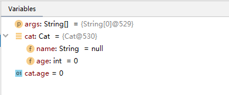

### 3.2. 父子类成员变量重名

我们说父类的所有成员变量都会继承到子类中，那么如果子类出现与父类同名的成员变量会怎么样呢？

父类代码：

```java
public class Father {  public int i=1;  private int j=1;  public int k=1;  public int getJ() {    return j;  }  public void setJ(int j) {    this.j = j;  }}
```

子类代码：

```java
public class Son extends Father{  public int i=2;  private int j=2;  public int m=2;} 
```

现在想要在子类Son中声明一个test()方法，并打印这些所有变量的值，该如何实现？

```java
public class Son extends Father{  public int i=2;  private int j=2;  public int m=2;    public void test() {    System.out.println("父类继承的i：" + super.i);    System.out.println("子类的i：" +i);    //System.out.println(super.j);    System.out.println("父类继承的j：" +getJ());    System.out.println("子类的j：" +j);    System.out.println("父类继承的k：" +k);    System.out.println("子类的m：" +m);  } } 
```

结论：

1）当父类的成员变量私有化时，在子类中是无法直接访问的，所以是否重名不影响，如果想要访问父类的私有成员变量，只能通过父类的get/set方法访问；

2）当父类的成员变量非私有时，在子类中可以直接访问，所以如果有重名时，就需要加“super."进行区别。

使用格式：

```
super.父类成员变量名
```

以上test()调用结果：

```java
public class TestSon{  public static void main(String[] args){    Son s = new Son();    s.test();  }}父类继承的i：1子类的i：2父类继承的j：1子类的j：2父类继承的k：1子类的m：2
```

idea中Debug查看对象的成员变量的值截图如下：


> **注意**：虽然我们可以区分父子类的重名成员变量，但是实际开发中，我们不建议这么干。

## 4. 继承特点（二） --- 成员方法

### 4.1. 方法重写

比如新的手机增加来电显示头像的功能，代码如下：

```java
class Phone {  public void sendMessage(){    System.out.println("发短信");  }  public void call(){    System.out.println("打电话");  }  public void showNum(){    System.out.println("来电显示号码");  }}//智能手机类class NewPhone extends Phone {  //重写父类的来电显示号码功能，并增加自己的显示姓名和图片功能  public void showNum(){    //调用父类已经存在的功能使用super    super.showNum();    //增加自己特有显示姓名和图片功能    System.out.println("显示来电姓名");    System.out.println("显示头像");  }}public class ExtendsDemo06 {  public static void main(String[] args) {        // 创建子类对象        NewPhone np = new NewPhone()；        // 调用父类继承而来的方法        np.call();        // 调用子类重写的方法        np.showNum();  }}
```

> **注意**：这里重写时，用到super.父类成员方法，表示调用父类的成员方法。

注意事项：

1）必须保证父子类之间方法的名称相同，参数列表也相同。

2）子类方法的返回值类型必须【小于等于】父类方法的返回值类型（小于其实就是是它的子类，例如：Student < Person）。

> **注意**：如果返回值类型是基本数据类型和void，那么必须是相同

3）子类方法的权限必须【大于等于】父类方法的权限修饰符。 **扩展提示**：public > protected > 缺省 > private

4）几种特殊的方法不能被重写：

- 静态方法不能被重写
- 私有等在子类中不可见的方法不能被重写
- final方法不能被重写

### 4.2. 方法重载

同一个类中

```java
class Test{	public int max(int a, int b){		return a > b ? a : b;	}	public double max(double a, double b){		return a > b ? a : b;	}	public int max(int a, int b,int c){		return max(max(a,b),c);	}}
```

父子类中

```java
class Father{	public void print(int i){		System.out.println("i = " + i);	}}class Son extends Father{	public void print(int i,int j){		System.out.println("i = " + i  ",j = " + j);	}}
```

> 对于Son类，相当于有两个print方法，一个形参列表是(int i)，一个形参列表(int i, int j)

## 5. 继承特点（三） --- 构造器

当类之间产生了关系，其中各类中的构造方法，又产生了哪些影响呢？

首先我们要回忆两个事情，构造方法的定义格式和作用。结论是：

1）构造方法的名字是与类名一致的，所以子类是**无法继承父类构造方法的**。

2）构造方法的作用是初始化实例变量的，而子类又会从父类继承所有成员变量，因此**子类必须能够初始化父类成员变量**。

所以子类的初始化过程中，必须先执行父类的初始化动作。子类的构造方法中默认有一个**`super()`** ，表示调用父类的实例初始化方法，父类成员变量初始化后，才可以给子类使用。代码如下：

```java
class Father {  private int n;  Father(){    System.out.println("Father()");  }}class Son extends Father {  Son(){    // super（），调用父类构造方法    super();    System.out.println("Son()");  }  }public class ExtendsDemo07{  public static void main (String args[]){    Son son = new Son();  }}输出结果：Father()Son()
```

如果父类没有无参构造怎么办？

```java
public class Person {	private String name;	private int age;	public Person(String name, int age) {		this.name = name;		this.age = age;	}	//其他成员方法省略}
```

```java
public class Student extends Person{	private int score;}
```

此时子类代码报错。

解决办法：在子类构造器中，用super(实参列表)，显示调用父类的有参构造解决。

```java
public class Student extends Person{	private int score;	public Student(String name, int age) {		super(name, age);	}	public Student(String name, int age, int score) {		super(name, age);		this.score = score;	}		//其他成员方法省略}
```

结论：

子类对象实例化过程中必须先完成从父类继承的成员变量的实例初始化，这个过程是通过调用父类的实例初始化方法来完成的。

1）super()：表示调用父类的无参实例初始化方法，要求父类必须有无参构造，而且可以省略不写；

2）super(实参列表)：表示调用父类的有参实例初始化方法，当父类没有无参构造时，子类的构造器首行必须写super(实参列表)来明确调用父类的哪个有参构造（其实是调用该构造器对应的实例初始方法）

3）super()和super(实参列表)都只能出现在子类构造器的首行

## 6. 继承特点（四） --- 单继承限制

**Java只支持单继承，不支持多继承**。

```java
//一个类只能有一个父类，不可以有多个父类。class C extends A{} 	//okclass C extends A，B...	//error
```

Java支持多层继承(继承体系)。

```java
class A{}class B extends A{}class C extends B{}
```

> 顶层父类是Object类。所有的类默认继承Object，作为父类。

子类和父类是一种相对的概念。例如：B类对于A来说是子类，但是对于C类来说是父类。一个父类可以同时拥有多个子类。

## 7. final修饰符

final：最终的，不可更改的，它的用法有：

### 7.1. 修饰类

表示这个类不能被继承，没有子类

```java
final class Eunuch{//太监类	}class Son extends Eunuch{//错误	}
```

### 7.2. 修饰方法

表示这个方法不能被子类重写

```java
class Father{	public final void method(){		System.out.println("father");	}}class Son extends Father{	public void method(){//错误		System.out.println("son");	}}
```

### 7.3. 声明常量

final修饰某个变量（成员变量或局部变量），表示它的值就不能被修改，即常量，常量名建议使用大写字母。

```java
public class Test{    public static void main(String[] args){    	final int MIN_SCORE = 0;    	final int MAX_SCORE = 100;    }}class Chinese{	public static final String COUNTRY = "中华人民共和国";		private String name;	public Chinese( String name) {		super();		this.name = name;	}	public Chinese() {		super();	}	public String getName() {		return name;	}	public void setName(String name) {		this.name = name;	}	//final修饰的没有set方法	public static String getCountry() {		return COUNTRY;	}}
```

> **注意**：如果某个成员变量用final修饰后，没有set方法，并且必须初始化（可以显式赋值、或在初始化块赋值、实例变量还可以在构造器中赋值）

## 8. this和super关键字

### 8.1. this的含义

this代表当前对象

### 8.2. this使用位置

1）this在实例初始化相关的代码块和构造器中：表示正在创建的那个实例对象，即正在new谁，this就代表谁

2）this在非静态实例方法中：表示调用该方法的对象，即谁在调用，this就代表谁。

3）this不能出现在静态代码块和静态方法中

### 8.3. this使用格式

1）this.成员变量名

- 当方法的局部变量与当前对象的成员变量重名时，就可以在成员变量前面加this.，如果没有重名问题，就可以省略this.
- this.成员变量会先从本类声明的成员变量列表中查找，如果未找到，会去从父类继承的在子类中仍然可见的成员变量列表中查找

2）this.成员方法

- 调用当前对象的成员方法时，都可以加"this."，也可以省略，实际开发中都省略
- 当前对象的成员方法，先从本类声明的成员方法列表中查找，如果未找到，会去从父类继承的在子类中仍然可见的成员方法列表中查找

3）this()或this(实参列表)

- 只能调用本类的其他构造器
- 必须在构造器的首行
- 如果一个类中声明了n个构造器，则最多有 n - 1个构造器中使用了"this(【实参列表】)"，否则会发生递归调用死循环

### 8.4. super的含义

super代表当前对象中从父类的引用的

### 8.5. super使用的前提

1）通过super引用父类的xx，都是在子类中仍然可见的

2）不能在静态代码块和静态方法中使用super

### 8.6. super的使用格式

#### 8.6.1. super.成员变量

在子类中访问父类的成员变量，特别是当子类的成员变量与父类的成员变量重名时。

```java
public class Test{    public static void main(String[] args){      Son s = new Son();      s.test(30);    }}class Father{  int a = 10;}class Son extends Father{  int a = 20;  public void test(int a){    System.out.println(super.a);//10    System.out.println(this.a);//20    System.out.println(a);//30  }}
```

#### 8.6.2. super.成员方法

在子类中调用父类的成员方法，特别是当子类重写了父类的成员方法时

```java
public class Test{    public static void main(String[] args){      Son s = new Son();      s.test();    }}class Father{  public void method(){    System.out.println("aa");  }}class Son extends Father{  public void method(){    System.out.println("bb");  }  public void test(){    method();//bb    this.method();//bb    super.method();//aa  }}
```

#### 8.6.3. super()或super(实参列表)

在子类的构造器首行，用于表示调用父类的哪个实例初始化方法

> super() 和 this() 都必须是在构造方法的第一行，所以不能同时出现。

### 8.7. 就近原则和追根溯源原则

#### 8.7.1. 找变量

1）**没有super和this**

- 在构造器、代码块、方法中如果出现使用某个变量，先查看是否是当前块声明的局部变量，
- 如果不是局部变量，先从当前执行代码的本类去找成员变量
- 如果从当前执行代码的本类中没有找到，会往上找父类的（非private，跨包还不能是缺省的）

2）**this** ：代表当前对象

- 通过this找成员变量时，先从当前执行代码的本类中找，没有的会往上找父类的（非private，跨包还不能是缺省的）。

3）**super** ：代表父类的

- 通过super找成员变量，直接从当前执行代码所在类的父类找
- super()或super(实参列表)只能从直接父类找
- 通过super只能访问父类在子类中可见的（非private，跨包还不能是缺省的）

#### 8.7.2. 找方法

1）没有super和this

- 先从当前对象（调用方法的对象）的本类找，如果没有，再从直接父类找，再没有，继续往上追溯

2）this

- 先从当前对象（调用方法的对象）的本类找，如果没有，再从父类继承的可见的方法列表中查找

3）super

- 直接从当前对象（调用方法的对象）的父类继承的可见的方法列表中查找

#### 8.7.3. 找构造器

1）this()或this(实参列表)：只从本类中，不会再往上追溯

2）super()或super(实参列表)：只从直接父类找，不会再往上追溯


# 四、类与对象（四）：抽象类、多态、根父类

## 1. 抽象类

### 1.1. 抽象类的由来

抽象：即不具体、或无法具体

例如：当我们声明一个几何图形类，如圆、矩形、三角形类等。发现这些类都有共同特征，包括求面积、求周长、获取图形详细信息。那么这些共同特征应该抽取到一个公共父类中。但是这些方法在父类中又**无法给出具体的实现**，而是应该交给子类各自具体实现。那么父类在声明这些方法时，**就只有方法签名，没有方法体**，我们把没有方法体的方法称为**抽象方法**。Java语法规定，包含抽象方法的类必须是**抽象类**。

### 1.2. 语法格式

**抽象方法** ： 没有方法体的方法。

**抽象类**：被abstract所修饰的类。

抽象类的语法格式

```java
【权限修饰符】 abstract class 类名{    }【权限修饰符】 abstract class 类名 extends 父类{    }
```

抽象方法的语法格式

```java
【其他修饰符】 abstract 返回值类型  方法名(【形参列表】);
```

> 注意：抽象方法没有方法体

代码举例：

```java
public abstract class Animal {    public abstract void run()；}
```

```java
public class Cat extends Animal {    public void run (){      	System.out.println("小猫在墙头走~~~")； 	     }}
```

```java
public class CatTest { 	 public static void main(String[] args) {        // 创建子类对象        Cat c = new Cat();                // 调用run方法        c.run();  	}}输出结果：小猫在墙头走~~~
```

此时的方法重写，是子类对父类抽象方法的完成实现，我们将这种方法重写的操作，也叫做**实现方法**。

### 1.3. 注意事项

关于抽象类的使用，以下为语法上要注意的细节，虽然条目较多，但若理解了抽象的本质，无需死记硬背。

1）抽象类**不能创建对象**，如果创建，编译无法通过而报错。只能创建其非抽象子类的对象。

> 理解：假设创建了抽象类的对象，调用抽象的方法，而抽象方法没有具体的方法体，没有意义。

2）抽象类中，也有构造方法，是供子类创建对象时，初始化父类成员变量使用的。

> 理解：子类的构造方法中，有默认的super()或手动的super(实参列表)，需要访问父类构造方法。

3）抽象类中，不一定包含抽象方法，但是有抽象方法的类必定是抽象类。

> 理解：未包含抽象方法的抽象类，目的就是不想让调用者创建该类对象，通常用于某些特殊的类结构设计。

4）抽象类的子类，必须重写抽象父类中**所有的**抽象方法，否则，编译无法通过而报错。除非该子类也是抽象类。 

> 理解：假设不重写所有抽象方法，则类中可能包含抽象方法。那么创建对象后，调用抽象的方法，没有意义。

## 2. 多态

### 2.1. 多态的引入

多态是继封装、继承之后，面向对象的第三大特性。

生活中，比如求面积的功能，圆、矩形、三角形实现起来是不一样的。跑的动作，小猫、小狗和大象，跑起来是不一样的。再比如飞的动作，昆虫、鸟类和飞机，飞起来也是不一样的。可见，同一行为，通过不同的事物，可以体现出来的不同的形态。那么此时就会出现各种子类的类型。

但是Java是强类型静态语言，既每一个变量在使用之前必须声明它确切的类型，然后之后的赋值和运算时都是严格按照这个数据类型来处理的。例如：

```java
int num = 10;String str = "hello";Student stu = new Student();
```

但是，有的时候，我们在设计一个数组、或一个方法的形参、返回值类型时，无法确定它具体的类型，只能确定它是某个系列的类型。

例如：想要设计一个数组用来存储各种图形的对象，并且按照各种图形的面积进行排序，但是具体存储的对象可能有圆、矩形、三角形等，那么各种图形的求面积方式又是不同的。

例如：想要设计一个方法，它的功能是比较两个图形的面积大小，返回面积较大的那个图形对象。那么此时形参和返回值类型是图形类型，但是不知道它具体是哪一种图形类型。

```java
Circle[] arr = new Circle[长度]; //只能装圆形对象Rectangle[] arr = new Rectangle[长度]; //只能装矩形对象//无法统一管理各种图形对象，例如：给各种图形对象按照面积排序//需要重载很多个方法，增加一种具体的图形，就需要增加一个方法public static Circle maxArea(Circle c1, Circle c2){//只能比较两个圆对象    }public static Rectangle maxArea(Rectangle r1, Rectangle r2){//只能比较两个矩形对象    }
```

这个时候，Java就引入了多态。

### 2.2. 多态的应用

#### 2.2.1. 多态参数

实际开发的过程中，父类类型作为方法形式参数，传递子类对象给方法，进行方法的调用，更能体现出多态的扩展性与便利。代码如下：

定义父类：

```java
public abstract class Animal {      public abstract void eat();  }  
```

定义子类：

```java
class Cat extends Animal {      public void eat() {          System.out.println("吃鱼");      }  }  class Dog extends Animal {      public void eat() {          System.out.println("吃骨头");      }  }
```

定义测试类：

```java
public class Test {    public static void main(String[] args) {        // 多态形式，创建对象        Cat c = new Cat();          Dog d = new Dog();         // 调用showCatEat         showCatEat(c);        // 调用showDogEat         showDogEat(d);         /*        以上两个方法, 均可以被showAnimalEat(Animal a)方法所替代        而执行效果一致        */        showAnimalEat(c);        showAnimalEat(d);     }    public static void showCatEat (Cat c){        c.eat();     }    public static void showDogEat (Dog d){        d.eat();    }    public static void showAnimalEat (Animal a){        a.eat();    }}
```

#### 2.2.2. 多态数组

例如：家里养了两只猫，两条狗，想要统一管理他们的对象，可以使用多态数组

```java
public class TestAnimal {  public static void main(String[] args) {    Animal[] all = new Animal[4];//可以存储各种Animal子类的对象    all[0] = new Cat();    all[1] = new Cat();    all[2] = new Dog();    all[3] = new Dog();        for (int i = 0; i < all.length; i++) {      all[i].eat();//all[i]编译时是Animal类型，运行时看存储的是什么对象    }  }}
```

### 2.3. 多态的使用原则

#### 2.3.1. 父类为非抽象类

```java
package com.drimwai;public class TestPolymorphism {    public static void main(String[] arg){        Father f1 = new Son();        Father f2 = new Daughter();        f1.test();//只看编译时类型        f2.test();    }}class Father{    public static void test(){        System.out.println("father");    }}class Son extends Father{    public static void test(){        System.out.println("son");    }}class Daughter extends Father{    public static void test(){        System.out.println("daughter");    }}
```

问题：优先执行最佳匹配（即父类）的成员方法，如何解决？

#### 2.3.2. 抽象类与动态绑定

```java
package com.drimwai;public class TestPolymorphism {    public static void main(String[] arg){        Father f1 = new Son();        Father f2 = new Daughter();        f1.test();//动态绑定        f2.test();    }}abstract class Father{    public abstract void test();}class Son extends Father{    public void test(){        System.out.println("son");    }}class Daughter extends Father{    public void test(){        System.out.println("daughter");    }}
```

## 3. Object根父类

### 3.1. 根父类的概述

类 `java.lang.Object`是类层次结构的根类，即**所有类的父类**。每个类都使用 `Object` 作为超类。

1）Object类型的变量与除Object以外的任意引用数据类型的对象都多态引用

2）所有对象（包括数组）都实现这个类的方法。

3）如果一个类没有特别指定父类，那么默认则继承自Object类。

### 3.2. 根父类的公共成员函数（API）

根据JDK源代码及Object类的API文档，Object类当中包含的方法有11个。我们主要列出其中的5个：

1）toString()

2）getClass()

3）finalize()

4）hashCode()

5）equals()


# 五、枚举、包装类、接口

## 1. 枚举

某些**类型的对象是有限的几个**，这样的例子举不胜举：

1）星期：Monday(星期一)......Sunday(星期天)

2）性别：Man(男)、Woman(女)

3）月份：January(1月)......December(12月)

4）季节：Spring(春节)......Winter(冬天)

5）支付方式：Cash（现金）、WeChatPay（微信）、Alipay(支付宝)、BankCard(银行卡)、CreditCard(信用卡)

6）员工工作状态：Busy（忙）、Free（闲）、Vocation（休假）

枚举类型本质上也是一种类，只不过是这个类的对象是固定的几个，而不能随意让用户创建。

### 1.1. 语法格式

```java
【修饰符】 enum 枚举类名{    常量对象列表}【修饰符】 enum 枚举类名{    常量对象列表;    常量属性列表；  	其他成员方法列表;}
```

示例代码：

```java
public class TestEnum {  public static void main(String[] args) {    Season spring = Season.SPRING;    System.out.println(spring);  }}enum Season{  SPRING,SUMMER,AUTUMN,WINTER}
```

示例代码：

```java
public class TestEnum {  public static void main(String[] args) {    Season spring = Season.SPRING;    System.out.println(spring);  }}enum Season{  SPRING("春"),SUMMER("夏"),AUTUMN("秋"),WINTER("冬");    private final String description;    private Season(String description){    this.description = description;  }    public String toString(){//需要手动编写，无法使用Generate toString()...    return description;  }}
```

枚举类的要求和特点：

1）枚举类的**常量对象列表必须在枚举类的首行**，因为是常量，所以建议大写。

2）如果常量对象列表后面**没有其他代码**，那么“；”可以省略，否则不可以省略“；”。

3）编译器给枚举类**默认提供的是private的无参构造**，如果枚举类需要的是无参构造，就不需要声明，写常量对象列表时也不用加参数，

4）如果枚举类**需要的是有参构造，需要手动定义private的有参构造**，调用有参构造的方法就是在常量对象名后面加(实参列表)就可以。

5）枚举类默认继承的是java.lang.Enum类，因此**不能再继承其他的类型**。

6）**JDK1.5之后switch，提供支持枚举类型**，case后面可以写枚举常量名。

7）枚举类型如有其它属性，建议（**不是必须**）这些属性也声明为final的，因为常量对象在逻辑意义上应该不可变。

### 1.2. 常用方法

```java
1.toString(): 默认返回的是常量名（对象名），可以继续手动重写该方法！2.name():返回的是常量名（对象名） 【很少使用】3.ordinal():返回常量的次序号，默认从0开始4.values():返回该枚举类的所有的常量对象，返回类型是当前枚举的数组类型，是一个静态方法5.valueOf(String name)：根据枚举常量对象名称获取枚举对象
```

示例代码：

```java
public class TestEnum {  public static void main(String[] args) {    Season[] values = Season.values();    for (int i = 0; i < values.length; i++) {      switch(values[i]){      case SPRING:        System.out.println(values[i]+":春暖花开，万物复苏");        break;      case SUMMER:        System.out.println(values[i]+":百花争艳，郁郁葱葱");        break;      case AUTUMN:        System.out.println(values[i]+":菊桂飘香，百树凋零");        break;      case WINTER:        System.out.println(values[i]+":梅花独开，大地一色");        break;      }    }  }}enum Season{  SPRING,SUMMER,AUTUMN,WINTER}
```

## 2. 包装类

Java提供了两个类型系统，**基本数据类型**与**引用数据类型**，使用基本类型在于效率。然而，**当要使用只针对对象设计的API或新特性（例如泛型），那么基本数据类型的数据就需要用包装类来包装**。

| 序号 | 基本数据类型 | 包装类（java.lang包） |
| ---- | ------------ | --------------------- |
| 1    | byte         | Byte                  |
| 2    | short        | Short                 |
| 3    | int          | **Integer**           |
| 4    | long         | Long                  |
| 5    | float        | Float                 |
| 6    | double       | Double                |
| 7    | char         | **Character**         |
| 8    | boolean      | Boolean               |
| 9    | void         | Void                  |

### 2.1. 装箱和拆箱

装箱：把基本数据类型转为包装类对象。

> 转为包装类的对象，是为了使用专门为对象设计的API和特性

拆箱：把包装类对象拆为基本数据类型。

> 转为基本数据类型，一般是因为需要运算，Java中的大多数运算符是为基本数据类型设计的。比较、算术等

基本数值---->包装对象

```java
Integer i1 = new Integer(4);//使用构造函数函数Integer i2 = Integer.valueOf(4);//使用包装类中的valueOf方法int i = 1;Integer i3 = i;
```

包装对象---->基本数值

```java
Integer i1 = new Integer(4);int num1 = i1.intValue();
```

JDK1.5之后，可以自动装箱与拆箱。

> 注意：只能与自己对应的类型之间才能实现自动装箱与拆箱。

```java
Integer i = 4;//自动装箱。相当于Integer i = Integer.valueOf(4);i = i + 5;//等号右边：将i对象转成基本数值(自动拆箱) i.intValue() + 5;//加法运算完成后，再次装箱，把基本数值转成对象。
```

```java
Integer i = 1;Double d = 1;//错误的，1是int类型
```

总结：对象（引用数据类型）能用的运算符有哪些？

1）instanceof

2）=：赋值运算符

3）==和!=：用于比较地址，但是要求左右两边对象的类型一致或者是有父子类继承关系。

4）对于字符串这一种特殊的对象，支持“+”，表示拼接。

### 2.2. 一些包装类API

基本数据类型和字符串之间的转换

```java
int a = 10;//String str = a;//错误的//方式一：String str = a + "";//方式二：String str = String.valueOf(a);
```

数据类型的最大最小值

```java
Integer.MAX_VALUE和Integer.MIN_VALUELong.MAX_VALUE和Long.MIN_VALUEDouble.MAX_VALUE和Double.MIN_VALUE
```

字符转大小写

```java
Character.toUpperCase('x');Character.toLowerCase('X');
```

整数转进制

```java
Integer.toBinaryString(int i) Integer.toHexString(int i)Integer.toOctalString(int i)
```

## 3. 接口

这种设计是将**规范**和实现分离，这也正是Java接口的好处。Java的软件系统会有很多模块组成，那么各个模块之间也应该采用这种面向接口的低耦合，为系统提供更好的可扩展性和可维护性。

例如：你能不能用USB进行连接，或是否具备USB通信功能，就看你是否遵循USB接口规范。

### 3.1. 接口定义格式

接口的定义，它与定义类方式相似，但是使用 `interface` 关键字。它也会被编译成.class文件，但一定要明确它并不是类，而是另外一种引用数据类型。

> 引用数据类型：数组，类，接口。

#### 3.1.1. 接口的声明格式

```java
【修饰符】 interface 接口名{    //接口的成员列表：    // 静态常量    // 抽象方法    // 默认方法    // 静态方法    // 私有方法}
```

示例代码：

```java
interface Usb3{    //静态常量		long MAX_SPEED = 500*1024*1024;//500MB/s        //抽象方法		void read();    void write();        //默认方法    default void start(){        System.out.println("开始");    }    default void stop(){        System.out.println("结束");    }        //静态方法    static void show(){        System.out.println("USB 3.0可以同步全速地进行读写操作");    }}
```

#### 3.1.2. 接口的成员说明

接口定义的是多个类共同的公共行为规范，这些行为规范是与外部交流的通道，这就意味着接口里通常是定义一组公共方法。

在JDK8之前，接口中只允许出现：

1）公共的静态常量：其中public static final可以省略

2）公共的抽象方法：其中public abstract可以省略

> 理解：接口是从多个相似类中抽象出来的规范，不需要提供具体实现

在JDK1.8时，接口中允许声明默认方法和静态方法：

3）公共的默认方法：其中public 可以省略，建议保留，但是default不能省略

4）公共的静态方法：其中public 可以省略，建议保留，但是static不能省略

在JDK1.9时，接口又增加了：

5）私有方法

除此之外，接口中不能有其他成员，没有构造器，没有初始化块，因为接口中没有成员变量需要初始化。

### 3.2. 实现接口

接口的使用，它**不能创建对象**，但是可以被实现（`implements` ，类似于被继承）。

类与接口的关系为实现关系，即**类实现接口**，该类可以称为接口的实现类，也可以称为接口的子类。实现的动作类似继承，格式相仿，只是关键字不同，实现使用 `implements`关键字。

#### 3.2.1. 实现接口语法格式

```java
【修饰符】 class 实现类  implements 接口{  // 重写接口中抽象方法【必须】，当然如果实现类是抽象类，那么可以不重写    // 重写接口中默认方法【可选】}【修饰符】 class 实现类 extends 父类 implements 接口{    // 重写接口中抽象方法【必须】，当然如果实现类是抽象类，那么可以不重写    // 重写接口中默认方法【可选】}
```

注意：

1）如果接口的实现类是非抽象类，那么必须重写接口中**所有**抽象方法。

2）默认方法可以选择保留，也可以重写。

3）不能重写静态方法

示例代码：

```java
class MobileHDD implements Usb3{  //重写/实现接口的抽象方法，【必选】  public void read() {    System.out.println("读数据");  }  public void write(){    System.out.println("写数据");  }    //重写接口的默认方法，【可选】  //重写默认方法时，default单词去掉  public void stop(){    System.out.println("清理硬盘中的隐藏回收站中的东西，再结束");  }}
```

#### 3.2.2. 如何调用对应的方法

1）对于接口的静态方法，直接使用“接口名.”进行调用即可

- 也只能使用“接口名."进行调用，不能通过实现类的对象进行调用

2）对于接口的抽象方法、默认方法，只能通过实现类对象才可以调用

- 接口不能直接创建对象，只能创建实现类的对象

```java
public class TestInteface {  public static void main(String[] args) {    //创建实现类对象    MobileHDD b = new MobileHDD();        //通过实现类对象调用重写的抽象方法，以及接口的默认方法，如果实现类重写了就执行重写的默认方法，如果没有重写，就执行接口中的默认方法    b.start();    b.read();    b.stop();        //通过接口名调用接口的静态方法    Usb3.show();  }}
```

### 3.3. 接口多实现

之前学过，在继承体系中，一个类只能继承一个父类。而对于接口而言，一个类是可以实现多个接口的，这叫做接口的**多实现**。并且，一个类能继承一个父类，同时实现多个接口。

实现格式：

```java
【修饰符】 class 实现类  implements 接口1，接口2，接口3。。。{  // 重写接口中所有抽象方法【必须】，当然如果实现类是抽象类，那么可以不重写    // 重写接口中默认方法【可选】}【修饰符】 class 实现类 extends 父类 implements 接口1，接口2，接口3。。。{    // 重写接口中所有抽象方法【必须】，当然如果实现类是抽象类，那么可以不重写    // 重写接口中默认方法【可选】}
```

> 接口中，有多个抽象方法时，实现类必须重写所有抽象方法。**如果抽象方法有重名的，只需要重写一次**。

定义多个接口：

```java
interface A {    public abstract void showA();    public abstract void show();}interface B {    public abstract void showB();    public abstract void show();}
```

定义实现类：

```java
public class C implements A,B{    @Override    public void showA() {        System.out.println("showA");    }    @Override    public void showB() {        System.out.println("showB");    }    @Override    public void show() {        System.out.println("show");    }}
```

### 3.4. 默认方法冲突问题

#### 3.4.1. 亲爹优先原则

当一个类，既继承一个父类，又实现若干个接口时，父类中的成员方法与接口中的抽象方法重名，子类就近选择执行父类的成员方法。代码如下：

定义接口：

```java
interface A {    public default void methodA(){        System.out.println("AAAAAAAAAAAA");    }}
```

定义父类：

```java
class D {    public void methodA(){        System.out.println("DDDDDDDDDDDD");    }}
```

定义子类：

```java
class C extends D implements A {  	// 未重写methodA方法}class B extends D implements A{    //当然也可以选择重写    public void methodA(){        System.out.println("BBBBBBBBBBBB");    }}
```

定义测试类：

```java
public class Test {    public static void main(String[] args) {        C c = new C();        c.methodA();                 B b = new B();        b.methodA();    }}输出结果:DDDDDDDDDDDDBBBBBBBBBBBB
```

#### 3.4.2. 必须做出选择

当一个类同时实现了多个接口，而多个接口中包含方法签名相同的默认方法时，怎么办呢？


无论你多难抉择，最终都是要做出选择的。代码如下：

声明接口：

```java
interface A{  public default void d(){    System.out.println("今晚7点-8点陪我吃饭看电影");  }}interface B{  public default void d(){    System.out.println("今晚7点-8点陪我逛街吃饭");  }}
```

选择保留其中一个，通过“接口名.super.方法名"的方法选择保留哪个接口的默认方法。

```java
class C implements A,B{  @Override  public void d() {    A.super.d();  }  }
```

选择自己完全重写：

```java
class D implements A,B{  @Override  public void d() {    System.out.println("自己待着");  }}
```

### 3.5. 接口的多继承

一个接口能继承另一个或者多个接口，接口的继承也使用 `extends` 关键字，子接口继承父接口的方法。

定义父接口：

```java
interface A {    void a();    public default void methodA(){        System.out.println("AAAAAAAAAAAAAAAAAAA");    }}interface B {    void b();    public default void methodB(){        System.out.println("BBBBBBBBBBBBBBBBBBB");    }}
```

定义子接口：

```java
interface C extends A,B{    @Override    public default void methodB() {        System.out.println("CCCCCCCCCCCCCCCCCCCC");    }}
```

> 小贴士：
>
> 子接口重写默认方法时，default关键字可以保留。
>
> 子类重写默认方法时，default关键字不可以保留。

```java
class D implements C{	@Override	public void a() {		System.out.println("xxxxx");	}	@Override	public void b() {		System.out.println("yyyyy");	}	}
```

```java
class E implements A,B,C{//效果和上面的D是等价的

	@Override
	public void b() {
		System.out.println("xxxxx");
	}

	@Override
	public void a() {
		System.out.println("yyyyy");
	}
	
}
```

### 3.6. 接口与实现类对象的多态引用

实现类实现接口，类似于子类继承父类，因此，接口类型的变量与实现类的对象之间，也可以构成多态引用。通过接口类型的变量调用方法，最终执行的是你new的实现类对象实现的方法体。

```java
public class TestInterface {
  public static void main(String[] args) {
    Usb3 u1 = new MacMobileHDD();
    u1.read();
  
    Usb3 u2 = new WinMobileHDD();
    u2.read();
  }
}

interface Usb3{
  //静态常量
    long MAX_SPEED = 500*1024*1024;//500MB/s
    //抽象方法
    void read();
    void write();
    //默认方法
    default void start(){
        System.out.println("开始");
    }
    default void stop(){
        System.out.println("结束");
    }
    //静态方法
    static void show(){
        System.out.println("USB 3.0可以同步全速地进行读写操作");
    }
}

class MacMobileHDD implements Usb3{
  //重写/实现接口的抽象方法
    public void read() {
        System.out.println("Mac电脑读数据");
    }
    public void write(){
        System.out.println("Mac电脑写数据");
    }
}

class WinMobileHDD implements Usb3{
  //重写/实现接口的抽象方法
    public void read() {
        System.out.println("Win电脑读数据");
    }
    public void write(){
        System.out.println("Win电脑写数据");
    }
}
```

# 第五章    注解和异常

# 一、注解

## 1. 注解概述

注解是以“**@注释名**”在代码中存在的，还可以添加一些参数值，例如：

```java
@SuppressWarnings(value=”unchecked”)
@Override
@Deprecated
@Test
@author
@param
....
```

注解Annotation是从JDK5.0开始引入。

虽然说**注解也是一种注释**，因为它们都不会改变程序原有的逻辑，只是对程序增加了某些注释性信息。不过它又不同于单行注释和多行注释，对于单行注释和多行注释是给程序员看的，而**注解是可以被编译器或其他程序读取的一种注释，程序还可以根据注解的不同，做出相应的处理**。

一个完整的注解有三个部分：

1）注解的声明：就如同类、方法、变量等一样，需要先声明后使用

2）注解的使用：用于注解在包、类、方法、属性、构造、局部变量等上面的10个位置中一个或多个位置

3）注解的读取：有一段专门用来读取这些使用的注解，然后根据注解信息作出相应的处理，这段程序称为注解处理流程，这也是注解区别与普通注释最大的不同。

## 2. 系统定义的三个基本注解

1）**@Override**

- 用于检测被修饰的方法为有效的重写方法，如果不是，则报编译错误
- 只能标记在方法上
- 它会被编译器程序读取

2）**@Deprecated**

- 用于表示被标记的数据已经过时，不建议使用
- 可以用于修饰属性、方法、构造、类、包、局部变量、参数
- 它会被编译器程序读取

3）**@SuppressWarnings**

- 抑制编译警告
- 可以用于修饰类、属性、方法、构造、局部变量、参数
- 它会被编译器程序读取

示例代码：

```java
public class TestAnnotation {
	@SuppressWarnings({"unused","rawtypes", "unchecked"})
	public static void main(String[] args) {
		
		int i;
	
		List list = new ArrayList();
		list.add("");
		list.add(123);
		list.add("");
		
		Father f = new Son();
		f.show();
		f.methodOl();
	}

}

class Father{
		@Deprecated
    public void show() {

    }
    public void method01() {
        System.out.println("Father Method");
    }
    public void println(){
        System.out.println("Father Method");
    }
    public int sum(int... nums){
        int sum = 0;
        for (int i = 0; i < nums.length; i++) {
            sum += nums[i];
        }
        return sum;
    }
}

class Son extends Father{
	
	@Override
    public void method01() {
        System.out.println("Son Method");
    }

    @Override
    public void println(String str){

    }

    @Override
    public int sum(int[] nums){
        int sum = 0;
        for (int i = 0; i < nums.length; i++) {
            sum += nums[i];
        }
        return sum;
    }
}
```

## 3. 自定义注解（了解）

JDK1.5在java.lang.annotation包定义了4个标准的meta-annotation类型，它们被用来提供对其它 annotation类型作说明。

1）@Target：用于描述注解的使用范围

* 可以通过枚举类型ElementType的10个常量对象来指定
* TYPE，METHOD，CONSTRUCTOR，PACKAGE.....

2）@Retention：用于描述注解的生命周期

* 可以通过枚举类型RetentionPolicy的3个常量对象来指定
* SOURCE（源代码）、CLASS（字节码）、RUNTIME（运行时）
* 唯有RUNTIME阶段才能被反射读取到。

3）@Documented：表明这个注解应该被 javadoc工具记录。

4）@Inherited：允许子类继承父类中的注解


系统注解代码：

```java
package java.lang;

import java.lang.annotation.*;

@Target(ElementType.METHOD)
@Retention(RetentionPolicy.SOURCE)
public @interface Override {
}
```

```java
package java.lang;

import java.lang.annotation.*;
import static java.lang.annotation.ElementType.*;

@Target({TYPE, FIELD, METHOD, PARAMETER, CONSTRUCTOR, LOCAL_VARIABLE})
@Retention(RetentionPolicy.SOURCE)
public @interface SuppressWarnings {
    String[] value();
}
```

```java
package java.lang;

import java.lang.annotation.*;
import static java.lang.annotation.ElementType.*;

@Documented
@Retention(RetentionPolicy.RUNTIME)
@Target(value={CONSTRUCTOR, FIELD, LOCAL_VARIABLE, METHOD, PACKAGE, PARAMETER, TYPE})
public @interface Deprecated {
}
```

自定义注解代码：

```java
package com.drimwai.annotation;

import java.lang.annotation.Documented;
import java.lang.annotation.ElementType;
import java.lang.annotation.Retention;
import java.lang.annotation.RetentionPolicy;
import java.lang.annotation.Target;

public class TestDefineAnnotation {
    public static void main(String[] args) {
        //读取注解信息
        MyAnnotation my = MyClass.class.getAnnotation(MyAnnotation.class);
        System.out.println(my.value());
    }
}

@MyAnnotation("Drimwai")
class MyClass{
}

@Documented
@Target(ElementType.TYPE)
@Retention(RetentionPolicy.RUNTIME)
@interface MyAnnotation{
    String value() default "Drimwai";
}

```


# 二、异常

## 1. 异常概述

在使用计算机语言进行项目开发的过程中，即使程序员把代码写得 尽善尽美，在系统的运行过程中仍然会遇到一些问题，因为很多问题不是靠代码能够避免的，比如：客户输入数据的格式，读取文件是否存在，网络是否始终保持通畅等等。

**异常** ：指的是程序在执行过程中，出现的非正常的情况，如果不处理最终会导致JVM的非正常停止。

> 异常指的并不是语法错误,语法错了,编译不通过,不会产生字节码文件,根本不能运行。
>
> 异常也不是指逻辑代码错误而没有得到想要的结果，例如：求a与b的和，你写成了a-b

对于异常，一般有两种解决方法：一是遇到错误就终止程序的运行。另一种方法是由程序员在编写程序时，就考虑到错误的检测、错误消息的提示，以及错误的处理。

Java中是如何表示不同的异常情况，又是如何让程序员得知，并处理异常的呢？

Java中把不同的异常用不同的类表示，一旦发生某种异常，就通过创建该异常类型的对象，并且抛出，然后程序员可以catch到这个异常对象，并处理，如果无法catch到这个异常对象，那么这个异常对象将会导致程序终止。

## 2. 异常体系

异常的根类是`java.lang.Throwable`，其下有两个子类：`java.lang.Error`与`java.lang.Exception`，平常所说的异常指`java.lang.Exception`。


### 2.1. **Throwable体系：**

**Error**:严重错误Error，无法通过处理的错误，只能事先避免。例如：StackOverflowError和OOM（OutOfMemoryError）。

**Exception**:表示异常，其它因编程错误或偶然的外在因素导致的一般性问题，程序员可以通过代码的方式纠正，使程序继续运行，是必须要处理的。例如：空指针访问、试图读取不存在的文件、网络连接中断、数组角标越界

### 2.2. **Throwable中的常用方法：**

1）`public void printStackTrace()`:打印异常的详细信息。

*包含了异常的类型,异常的原因,还包括异常出现的位置,在开发和调试阶段,都得使用printStackTrace。*

2）`public String getMessage()`:获取发生异常的原因。

*提示给用户的时候,就提示错误原因。*

***出现异常,不要紧张,把异常的简单类名,拷贝到API中去查。***


## 3. 异常分类

我们平常说的异常就是指Exception，因为这类异常一旦出现，我们就要对代码进行更正，修复程序。

**异常(Exception)的分类**:根据在编译时期还是运行时期去检查异常?

1）**编译时期异常**: checked异常。在编译时期,就会检查,如果没有处理异常,则编译失败。(如文件找不到异常)

2）**运行时期异常**: runtime异常。在运行时期,检查异常.在编译时期,运行异常不会被编译器检测到(不报错)。(如数组索引越界异常，类型转换异常)。程序员应该积极避免其出现的异常，而不是使用try..catch处理，因为这类异常很普遍，若都使用try..catch或throws处理可能会对程序的可读性和运行效率产生影响。

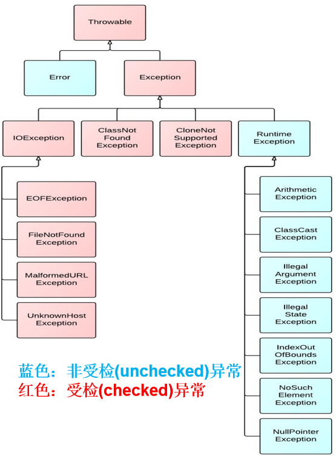

### 3.1. VirtualMachineError

最常见的就是：StackOverflowError、OutOfMemoryError

```java
	@Test
	public void test01(){
		//StackOverflowError
		digui();
	}
	
	public void digui(){
		digui();
	}
```

```java
	@Test
	public void test02(){
		//OutOfMemoryError
		//方式一：
		int[] arr = new int[Integer.MAX_VALUE];
	}
	@Test
	public void test03(){
		//OutOfMemoryError
		//方式二：
		StringBuilder s = new StringBuilder();
		while(true){
			s.append("atguigu");
		}
	}
```

### 3.2. 运行时异常

```java
	@Test	public void test01(){	    //NullPointerException		int[][] arr = new int[3][];		System.out.println(arr[0].length);	}		@Test	public void test02(){		//ClassCastException		Person p = new Man();		Woman w = (Woman) p;	}		@Test	public void test03(){		//ArrayIndexOutOfBoundsException		int[] arr = new int[5];		for (int i = 1; i <= 5; i++) {			System.out.println(arr[i]);		}	}		@Test	public void test04(){		//InputMismatchException		Scanner input = new Scanner(System.in);		System.out.print("请输入一个整数：");		int num = input.nextInt();	}		@Test	public void test05(){		int a = 1;		int b = 0;		//ArithmeticException		System.out.println(a/b);	}
```

### 3.3. 编译时异常

```java
	@Test	public void test06() {		Thread.sleep(1000);//休眠1秒	}		@Test	public void test07() {		FileInputStream fis = new FileInputStream("Java学习秘籍.txt");	}		@Test	public void test08() {		Connection conn = DriverManager.getConnection("....");	}
```

## 4. 异常抛出机制

先运行下面的程序，程序会产生一个数组索引越界异常ArrayIndexOfBoundsException。我们通过图解来解析下异常产生的过程。

 工具类

```java
public class ArrayTools {    // 对给定的数组通过给定的角标获取元素。    public static int getElement(int[] arr, int index) {        int element = arr[index];        return element;    }}
```

 测试类

```java
public class ExceptionDemo {    public static void main(String[] args) {        int[] arr = { 34, 12, 67 };        int num = ArrayTools.getElement(arr, 4)        System.out.println("num=" + num);        System.out.println("over");    }}
```

上述程序执行过程图解：


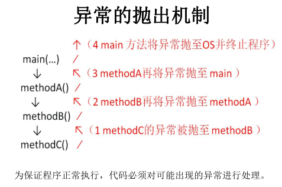

## 5. 异常处理

Java异常处理的五个关键字：**throw、throws、try、catch、finally**

### 5.1. 抛出throw

Java程序的执行过程中如出现异常，会生成一个异常类对象，该异常对象将被提交给Java运行时系统，这个过程称为抛出(throw)异常。异常对象的生成有两种方式：

1）**由虚拟机自动生成**：程序运行过程中，虚拟机检测到程序发生了问题，如果在当前代码中没有找到相应的处理程序，就会在后台自动创建一个对应异常类的实例对象并抛出——自动抛出

2）**由开发人员手动创建**：Exception exception = new ClassCastException();——创建好的异常对象不抛出对程序没有任何影响，和创建一个普通对象一样，但是一旦throw抛出，就会对程序运行产生影响了。

下面我们说明手动抛出异常：

比如，在定义方法时，方法需要接受参数。那么，当调用方法使用接受到的参数时，首先需要先对参数数据进行合法的判断，数据若不合法，就应该告诉调用者，这时可以使用抛出异常的方式来告诉调用者。

在java中，提供了一个**throw**关键字，它用来抛出一个指定的异常对象。那么，抛出一个异常具体如何操作呢？

1）创建一个异常对象。封装一些提示信息(信息可以自己编写)。

2）需要将这个异常对象告知给调用者。怎么告知呢？怎么将这个异常对象传递到调用者处呢？通过关键字throw就可以完成。throw 异常对象。

3）throw**用在方法内**，用来抛出一个异常对象，将这个异常对象传递到调用者处，并**结束**当前方法的执行。

**使用格式：**

~~~
throw new 异常类名(参数);
~~~

 例如：

~~~java
throw new NullPointerException("要访问的arr数组不存在");throw new ArrayIndexOutOfBoundsException("该索引在数组中不存在，已超出范围");
~~~

学习完抛出异常的格式后，我们通过下面程序演示下throw的使用。

~~~java
public class ThrowDemo {    public static void main(String[] args) {        //创建一个数组         int[] arr = {2,4,52,2};        //根据索引找对应的元素         int index = 4;        int element = getElement(arr, index);        System.out.println(element);        System.out.println("over");    }    /*     * 根据 索引找到数组中对应的元素     */    public static int getElement(int[] arr,int index){         if(arr == null){            /*             判断条件如果满足，当执行完throw抛出异常对象后，方法已经无法继续运算。             这时就会结束当前方法的执行，并将异常告知给调用者。这时就需要通过异常来解决。               */            throw new NullPointerException("要访问的arr数组不存在");        }       	//判断  索引是否越界        if(index<0 || index>arr.length-1){             /*             判断条件如果满足，当执行完throw抛出异常对象后，方法已经无法继续运算。             这时就会结束当前方法的执行，并将异常告知给调用者。这时就需要通过异常来解决。               */             throw new ArrayIndexOutOfBoundsException("哥们，角标越界了~~~");        }        int element = arr[index];        return element;    }}
~~~

### 5.2. 声明异常throws

**声明异常**：将问题标识出来，报告给调用者。如果方法内通过throw抛出了**编译时异常**，而没有**捕获处理**（稍后讲解该方式），那么必须通过throws进行声明，让调用者去处理。

关键字**throws**运用于方法声明之上,用于表示当前方法不处理异常,而是提醒该方法的调用者来处理异常(抛出异常).

**声明异常格式：**

~~~
修饰符 返回值类型 方法名(参数) throws 异常类名1,异常类名2…{   }	
~~~

声明异常的代码演示：

~~~java
import java.io.File;import java.io.FileNotFoundException;public class TestException {	public static void main(String[] args) throws FileNotFoundException {		readFile("不敲代码学会Java秘籍.txt");	}		// 如果定义功能时有问题发生需要报告给调用者。可以通过在方法上使用throws关键字进行声明	public static void readFile(String filePath) throws FileNotFoundException{		File file = new File(filePath);		if(!file.exists()){			throw new FileNotFoundException(filePath+"文件不存在");		}	}	}
~~~

throws用于进行异常类的声明，若该方法可能有多种异常情况产生，那么在throws后面可以写多个异常类，用逗号隔开。

~~~java
import java.io.File;import java.io.FileNotFoundException;public class TestException {	public static void main(String[] args) throws FileNotFoundException,IllegalAccessException {		readFile("不敲代码学会Java秘籍.txt");	}		// 如果定义功能时有问题发生需要报告给调用者。可以通过在方法上使用throws关键字进行声明	public static void readFile(String filePath) throws FileNotFoundException,IllegalAccessException{		File file = new File(filePath);		if(!file.exists()){			throw new FileNotFoundException(filePath+"文件不存在");		}		if(!file.isFile()){			throw new IllegalAccessException(filePath + "不是文件，无法直接读取");		}		//...	}	}
~~~

### 5.3. 捕获异常try...catch

捕获异常语法如下：

~~~java
try{     编写可能会出现异常的代码}catch(异常类型1  e){     处理异常的代码     //记录日志/打印异常信息/继续抛出异常}catch(异常类型2  e){     处理异常的代码     //记录日志/打印异常信息/继续抛出异常}....
~~~

**try：**该代码块中编写可能产生异常的代码。

**catch：**用来进行某种异常的捕获，实现对捕获到的异常进行处理。

1）可以有多个catch块，按顺序匹配。

2）如果多个异常类型有包含关系，那么小上大下

演示如下：

~~~java
public class TestException {	public static void main(String[] args)  {		try {			readFile("不敲代码学会Java秘籍.txt");		} catch (FileNotFoundException e) {//			e.printStackTrace();//			System.out.println("好好敲代码，不要老是想获得什么秘籍");			System.out.println(e.getMessage());		} catch (IllegalAccessException e) {			e.printStackTrace();		} 				System.out.println("继续学习吧...");	}		// 如果定义功能时有问题发生需要报告给调用者。可以通过在方法上使用throws关键字进行声明	public static void readFile(String filePath) throws FileNotFoundException, IllegalAccessException{		File file = new File(filePath);		if(!file.exists()){			throw new FileNotFoundException(filePath+"文件不存在");		}		if(!file.isFile()){			throw new IllegalAccessException(filePath + "不是文件，无法直接读取");		}		//...	}	}
~~~

如何获取异常信息：

Throwable类中定义了一些查看方法:

1）`public String getMessage()`:获取异常的描述信息,原因(提示给用户的时候,就提示错误原因。

2）`public void printStackTrace()`:打印异常的跟踪栈信息并输出到控制台。

**注意**：包含了异常的类型,异常的原因,还包括异常出现的位置,在开发和调试阶段,都得使用printStackTrace。

### 5.4. finally块

**finally**：有一些特定的代码无论异常是否发生，都需要执行。另外，因为异常会引发程序跳转，导致有些语句执行不到。而finally就是解决这个问题的，在finally代码块中存放的代码都是一定会被执行的。

什么时候的代码必须最终执行？

当我们在try语句块中打开了一些物理资源(磁盘文件/网络连接/数据库连接等),我们都得在使用完之后,最终关闭打开的资源。

finally的语法:

```java
 try{      }catch(...){      }finally{     无论try中是否发生异常，也无论catch是否捕获异常，也不管try和catch中是否有return语句，都一定会执行 }  或  try{      }finally{     无论try中是否发生异常，也不管try中是否有return语句，都一定会执行 } 
```

> 注意:finally不能单独使用。

比如在我们之后学习的IO流中，当打开了一个关联文件的资源，最后程序不管结果如何，都需要把这个资源关闭掉。

finally代码参考如下：

```java
import java.io.File;
import java.io.FileInputStream;
import java.io.FileNotFoundException;
import java.io.IOException;

public class TestException {
	public static void main(String[] args)  {
		readFile("不敲代码学会Java秘籍.txt");
		System.out.println("继续学习吧...");
	}
	
	// 如果定义功能时有问题发生需要报告给调用者。可以通过在方法上使用throws关键字进行声明
	public static void readFile(String filePath) {
		File file = new File(filePath);
		FileInputStream fis = null;
		try {
			
			if(!file.exists()){
				throw new FileNotFoundException(filePath+"文件不存在");
			}
			if(!file.isFile()){
				throw new IllegalAccessException(filePath + "不是文件，无法直接读取");
			}
			fis = new FileInputStream(file);
			//...
		} catch (Exception e) {
			//抓取到的是编译期异常  抛出去的是运行期 
			throw new RuntimeException(e);
		}finally{
			System.out.println("无论如何，这里的代码一定会被执行");
			try {
				if(fis!=null){
					fis.close();
				}
			} catch (IOException e) {
				//抓取到的是编译期异常  抛出去的是运行期 
				throw new RuntimeException(e);
			}
		}
		
	}
}
```

> 当只有在try或者catch中调用退出JVM的相关方法，例如System.exit(0),此时finally才不会执行,否则finally永远会执行。

### 5.5. finally与return 

形式一：从try回来

```java
public class TestReturn {
	public static void main(String[] args) {
		int result = test("12");
		System.out.println(result);
	}

	public static int test(String str){
		try{
			Integer.parseInt(str);
			return 1;
		}catch(NumberFormatException e){
			return -1;
		}finally{
			System.out.println("test结束");
		}
	}
}
```

形式二：从catch回来

```java
public class TestReturn {
	public static void main(String[] args) {
		int result = test("a");
		System.out.println(result);
	}

	public static int test(String str){
		try{
			Integer.parseInt(str);
			return 1;
		}catch(NumberFormatException e){
			return -1;
		}finally{
			System.out.println("test结束");
		}
	}
}
```

形式三：从finally回来

```java
public class TestReturn {
	public static void main(String[] args) {
		int result = test("a");
		System.out.println(result);
	}

	public static int test(String str){
		try{
			Integer.parseInt(str);
			return 1;
		}catch(NumberFormatException e){
			return -1;
		}finally{
            System.out.println("test结束");
			return 0;
		}
	}
}
```

# 第六章    类库和基础API


# 一、类库和API的简介

## 1. 类库和API

Java 官方为开发者提供了很多功能强大的类，这些类被分别放在各个包中，随JDK一起发布，称为Java类库或Java API。

API（Application Programming Interface, 应用程序编程接口）是一个通用概念。

例如我编写了一个类，可以获取计算机的各种硬件信息，它很强大很稳定，如果你的项目也需要这样一个功能，那么你就无需再自己编写代码，将我的类拿来直接用就可以。但是，我的类代码很复杂，让你读完这些代码不太现实，而且我也不希望你看到我的代码（你也没必要也不希望读懂这些晦涩的代码），我要保护我的版权，怎么办呢？

我可以先将我的类编译，并附带一个文档，告诉你我的类怎么使用，有哪些方法和属性，你只需要按照文档的说明来调用就完全没问题，既节省了你阅读代码的时间，也保护了我的版权。例如，获取CPU信息的方法：  getCpuInfo(int cpuType); 这就是一个API。也就是说，该**文档中描述的类的使用方法**，就叫做API。

Java API也有一个说明文档，入口地址：http://www.oracle.com/technetwork/java/api

选择对应版本的Java，点击链接进入即可。J2SE 1.7 的API地址为：http://docs.oracle.com/javase/7/docs/api/

打开J2SE 1.7 的API文档，如下图所示：


Java类库中有很多包：

1）以 java.* 开头的是Java的核心包，所有程序都会使用这些包中的类；

2）以 javax.* 开头的是扩展包，x 是 extension 的意思，也就是扩展。虽然 javax.* 是对 java.* 的优化和扩展，但是由于 javax.* 使用的越来越多，很多程序都依赖于 javax.*，所以 javax.* 也是核心的一部分了，也随JDK一起发布。

3）以 org.* 开头的是各个机构或组织发布的包，因为这些组织很有影响力，它们的代码质量很高，所以也将它们开发的部分常用的类随JDK一起发布。

在包的命名方面，为了防止重名，有一个惯例：大家都以自己域名的倒写形式作为开头来为自己开发的包命名，例如百度发布的包会以 com.baidu.* 开头，w3c组织发布的包会以 org.w3c.* 开头，微学苑发布的包会以 net.weixueyuan.* 开头……

组织机构的域名后缀一般为 org，公司的域名后缀一般为 com，可以认为 org.* 开头的包为非盈利组织机构发布的包，它们一般是开源的，可以免费使用在自己的产品中，不用考虑侵权问题，而以 com.* 开头的包往往由盈利性的公司发布，可能会有版权问题，使用时要注意。

java中常用的几个包介绍：

| 包名        | 说明                                                         |
| ----------- | ------------------------------------------------------------ |
| java.lang   | 该包提供了Java编程的基础类，例如 Object、Math、String、StringBuffer、System、Thread等，不使用该包就很难编写Java代码了。 |
| java.util   | 该包提供了包含集合框架、遗留的集合类、事件模型、日期和时间实施、国际化和各种实用工具类（字符串标记生成器、随机数生成器和位数组）。 |
| java.io     | 该包通过文件系统、数据流和序列化提供系统的输入与输出。       |
| java.net    | 该包提供实现网络应用与开发的类。                             |
| java.sql    | 该包提供了使用Java语言访问并处理存储在数据源（通常是一个关系型数据库）中的数据API。 |
| java.awt    | 这两个包提供了GUI设计与开发的类。java.awt包提供了创建界面和绘制图形图像的所有类，而javax.swing包提供了一组“轻量级”的组件，尽量让这些组件在所有平台上的工作方式相同。 |
| javax.swing |                                                              |
| java.text   | 提供了与自然语言无关的方式来处理文本、日期、数字和消息的类和接口。 |

更多的包和说明请参考API文档。

## 2. 框架是什么？

任何编程语言在最初的时候都是没有框架的，后来随着在实际开发过程中不断总结<span style="color:blue;font-weight:bold;">『经验』</span>，积累<span style="color:blue;font-weight:bold;">『最佳实践』</span>，慢慢的人们发现很多<span style="color:blue;font-weight:bold;">『特定场景』</span>下的<span style="color:blue;font-weight:bold;">『特定问题』</span>总是可以<span style="color:blue;font-weight:bold;">『套用固定解决方案』</span>。

于是有人把成熟的<span style="color:blue;font-weight:bold;">『固定解决方案』</span>收集起来，整合在一起，就成了<span style="color:blue;font-weight:bold;">『框架』</span>。

在使用框架的过程中，我们往往只需要告诉框架<span style="color:blue;font-weight:bold;">『做什么（声明）』</span>，而不需要关心框架<span style="color:blue;font-weight:bold;">『怎么做（编程）』</span>。

对于Java程序来说，我们使用框架就是导入那些封装了<span style="color:blue;font-weight:bold;">『固定解决方案』</span>的jar包，然后通过<span style="color:blue;font-weight:bold;">『配置文件』</span>告诉框架做什么，就能够大大简化编码，提高开发效率。我们使用过的junit其实就是一款单元测试框架。

而对于JavaScript程序来说，我们使用框架就是导入那些封装了<span style="color:blue;font-weight:bold;">『固定解决方案』</span>的<span style="color:blue;font-weight:bold;">『js文件』</span>，然后在框架的基础上编码。

> 用洗衣服来类比框架：
>
> 典型应用场景：洗衣服
>
> 输入数据：衣服、洗衣液、水
>
> 不使用框架：手洗
>
> 使用框架：使用洗衣机，对人来说，只需要按键，具体操作是洗衣机完成的。人只是告诉洗衣机做什么，具体的操作是洗衣机完成的。

实际开发中使用框架时，我们也主要是告诉框架要做什么，具体操作是框架完成的。

**其实框架的本质也是类库的类和API，只不过它们是用于指导程序编的固定解决方案。**


# 二、系统相关的类与API

## 1. java.lang.System类

系统类中很多好用的方法，其中几个如下：

1）static long currentTimeMillis() ：返回当前系统时间距离1970-1-1 0:0:0的毫秒值

2）static void arraycopy(Object src, int srcPos, Object dest, int destPos, int length)： 

- 从指定源数组中复制一个数组，复制从指定的位置开始，到目标数组的指定位置结束。常用于数组的插入和删除

3）static void exit(int status) ：退出当前系统

4）static void gc() ：运行垃圾回收器。

5）static String getProperty(String key)：获取某个系统属性

...

```java
public class Test{
    public static void main(String[] args){
    	long time = System.currentTimeMillis();
    	System.out.println("现在的系统时间距离1970年1月1日凌晨：" + time + "毫秒");
    	
    	System.exit(0);

    	System.out.println("over");//不会执行
    }
}
```

## 2. java.lang.Runtime类

每个 Java 应用程序都有一个 `Runtime` 类实例，使应用程序能够与其运行的环境相连接。可以通过  `getRuntime` 方法获取当前运行时。  应用程序不能创建自己的 Runtime 类实例。

1）public static Runtime getRuntime()： 返回与当前 Java 应用程序相关的运行时对象。

2）public long totalMemory()：返回 Java 虚拟机中的内存总量。此方法返回的值可能随时间的推移而变化，这取决于主机环境。

3）public long freeMemory()：回 Java 虚拟机中的空闲内存量。调用 gc 方法可能导致 freeMemory 返回值的增加。


# 三、字符串相关的类与API

`java.lang.String` 类代表字符串。Java程序中所有的字符串文字（例如`"abc"` ）都可以被看作是实现此类的实例。字符串是常量；它们的值在创建之后不能更改。字符串缓冲区支持可变的字符串。因为 String 对象是不可变的，所以可以共享。

`String` 类包括的方法可用于检查序列的单个字符、比较字符串、搜索字符串、提取子字符串、创建字符串副本并将所有字符全部转换为大写或小写。 

Java 语言提供对字符串串联符号（"+"）以及将其他对象转换为字符串的特殊支持（toString()方法）。

## 1. 字符串的特点

1、字符串String类型本身是final声明的，意味着我们不能继承String。

2、字符串的对象也是不可变对象，意味着一旦进行修改，就会产生新对象

> 我们修改了字符串后，如果想要获得新的内容，必须重新接受。
>
> 如果程序中涉及到大量的字符串的修改操作，那么此时的时空消耗比较高。可能需要考虑使用StringBuilder或StringBuffer的可变字符序列。

3、String对象内部是用字符数组进行保存的

> JDK1.9之前有一个char[] value数组，JDK1.9之后byte[]数组

`"abc"` 等效于 `char[] data={ 'a' , 'b' , 'c' }`。

```java
例如： 
String str = "abc";

相当于： 
char data[] = {'a', 'b', 'c'};     
String str = new String(data);
// String底层是靠字符数组实现的。
```

4、String类中这个char[] values数组也是final修饰的，意味着这个数组不可变，然后它是private修饰，外部不能直接操作它，String类型提供的所有的方法都是用新对象来表示修改后内容的，所以保证了String对象的不可变。

## 2. 构造字符串对象

### 2.1. 使用构造方法

1）`public String() ` ：初始化新创建的 String对象，以使其表示空字符序列。

2）` String(String original)`： 初始化一个新创建的 `String` 对象，使其表示一个与参数相同的字符序列；换句话说，新创建的字符串是该参数字符串的副本。

3）`public String(char[] value) ` ：通过当前参数中的字符数组来构造新的String。

4）`public String(char[] value,int offset, int count) ` ：通过字符数组的一部分来构造新的String。

5）`public String(byte[] bytes) ` ：通过使用平台的默认字符集解码当前参数中的字节数组来构造新的String。

6）`public String(byte[] bytes,String charsetName) ` ：通过使用指定的字符集解码当前参数中的字节数组来构造新的String。

构造举例，代码如下：

```java
//字符串常量对象
String str = "hello";

// 无参构造
String str1 = new String（）；

//创建"hello"字符串常量的副本
String str2 = new String("hello");

//通过字符数组构造
char chars[] = {'a', 'b', 'c','d','e'};     
String str3 = new String(chars);
String str4 = new String(chars,0,3);

// 通过字节数组构造
byte bytes[] = {97, 98, 99 };     
String str5 = new String(bytes);
String str6 = new String(bytes,"GBK");
```

### 2.2. 使用静态方法

1）static String copyValueOf(char[] data)： 返回指定数组中表示该字符序列的 String

2）static String copyValueOf(char[] data, int offset, int count)：返回指定数组中表示该字符序列的 String

3）static String valueOf(char[] data)  ： 返回指定数组中表示该字符序列的 String

4）static String valueOf(char[] data, int offset, int count) ： 返回指定数组中表示该字符序列的 String

5）static String valueOf(xx  value)：xx支持各种数据类型，返回各种数据类型的value参数的字符串表示形式。

```java
	public static void main(String[] args) {
		char[] data = {'h','e','l','l','o','j','a','v','a'};
		String s1 = String.copyValueOf(data);
		String s2 = String.copyValueOf(data,0,5);
		int num = 123456;
		String s3 = String.valueOf(num);
		System.out.println(s1);
		System.out.println(s2);
		System.out.println(s3);
	}
```

### 2.3. 使用""+

任意数据类型与"字符串"进行拼接，结果都是字符串

```java
	public static void main(String[] args) {
		int num = 123456;
		String s = num + "";
		System.out.println(s);
		
		Student stu = new Student();
		String s2 = stu + "";//自动调用对象的toString()，然后与""进行拼接
		System.out.println(s2);
	}
```

## 3. 字符串对象比较

### 3.1. 非空字符串比较

**==**：不推荐使用

> 只有两个字符串变量都是指向字符串的常量对象时，才会返回true

```java
String str1 = "hello";
String str2 = "hello";
System.out.println(str1 == str2);//true
    
String str3 = new String("hello");
String str4 = new String("hello");
System.out.println(str1 == str4); //false
System.out.println(str3 == str4); //false
```

**equals()**：比较是对象的内容，因为String类型重写equals，区分大小写

只要两个字符串的字符内容相同，就会返回true

```java
String str1 = "hello";
String str2 = "hello";
System.out.println(str1.equals(str2));//true
    
String str3 = new String("hello");
String str4 = new String("hello");
System.out.println(str1.equals(str3));//true
System.out.println(str3.equals(str4));//true
```

**equalsIgnoreCase()**：比较的是对象的内容，不区分大小写

```java
String str1 = new String("hello");
String str2 = new String("HELLO");
System.out.println(str1.equalsIgnoreCase(strs)); //true
```

**compareTo()**：String类型重写了Comparable接口的抽象方法，自然排序，按照字符的Unicode编码值进行比较大小的，严格区分大小写

```java
String str1 = "hello";String str2 = "world";str1.compareTo(str2) //小于0的值
```

**compareToIgnoreCase()**：不区分大小写，其他按照字符的Unicode编码值进行比较大小

```java
String str1 = new String("hello");String str2 = new String("HELLO");str1.compareToIgnoreCase(str2)  //等于0
```

### 3.2. 空字符串比较

哪些是空字符串？

```java
String str1 = "";String str2 = new String();String str3 = new String("");
```

空字符串：长度为0

如何判断某个字符串是否是空字符串？

```java
if("".equals(str))if(str!=null  && str.isEmpty())if(str!=null && str.equals(""))if(str!=null && str.length()==0)
```

## 4. 字符串常用方法

### 4.1. 基本方法

1）boolean isEmpty()：字符串是否为空

2）int length()：返回字符串的长度

3）String concat(xx)：拼接，等价于+

4）boolean equals(Object obj)：比较字符串是否相等，区分大小写

5）boolean equalsIgnoreCase(Object obj)：比较字符串是否相等，区分大小写

6）int compareTo(String other)：比较字符串大小，区分大小写，按照Unicode编码值比较大小

7）int compareToIgnoreCase(String other)：比较字符串大小，不区分大小写

8）String toLowerCase()：将字符串中大写字母转为小写

9）String toUpperCase()：将字符串中小写字母转为大写

10）String trim()：去掉字符串前后空白符

```java
	@Test
	public void test01(){
		//将用户输入的单词全部转为小写，如果用户没有输入单词，重新输入
		Scanner input = new Scanner(System.in);
		String word;
		while(true){
			System.out.print("请输入单词：");
			word = input.nextLine();
			if(word.trim().length()!=0){
				word = word.toLowerCase();
				break;
			}
		}
		System.out.println(word);
	}

	@Test
	public void test02(){
        //随机生成验证码，验证码由0-9，A-Z,a-z的字符组成
		char[] array = new char[26*2+10];
		for (int i = 0; i < 10; i++) {
			array[i] = (char)('0' + i);
		}
		for (int i = 10,j=0; i < 10+26; i++,j++) {
			array[i] = (char)('A' + j);
		}
		for (int i = 10+26,j=0; i < array.length; i++,j++) {
			array[i] = (char)('a' + j);
		}
		String code = "";
		Random rand = new Random();
		for (int i = 0; i < 4; i++) {
			code += array[rand.nextInt(array.length)];
		}
		System.out.println("验证码：" + code);
		//将用户输入的单词全部转为小写，如果用户没有输入单词，重新输入
		Scanner input = new Scanner(System.in);
		System.out.print("请输入验证码：");
		String inputCode = input.nextLine();
		
		if(!code.equalsIgnoreCase(inputCode)){
			System.out.println("验证码输入不正确");
		}
	}
```

### 4.2. 查找

1）boolean contains(xx)：是否包含xx

2）int indexOf(xx)：从前往后找当前字符串中xx，即如果有返回第一次出现的下标，要是没有返回-1

3）int lastIndexOf(xx)：从后往前找当前字符串中xx，即如果有返回最后一次出现的下标，要是没有返回-1

```java
	@Test	public void test01(){		String str = "尚硅谷是一家靠谱的培训机构，尚硅谷可以说是IT培训的小清华，JavaEE是尚硅谷的当家学科，尚硅谷的大数据培训是行业独角兽。尚硅谷的前端和运维专业一样独领风骚。";		System.out.println("是否包含清华：" + str.contains("清华"));		System.out.println("培训出现的第一次下标：" + str.indexOf("培训"));		System.out.println("培训出现的最后一次下标：" + str.lastIndexOf("培训"));	}
```

### 4.3. 字符串截取

1）String substring(int beginIndex) ：返回一个新的字符串，它是此字符串的从beginIndex开始截取到最后的一个子字符串。 

2）String substring(int beginIndex, int endIndex) ：返回一个新字符串，它是此字符串从beginIndex开始截取到endIndex(不包含)的一个子字符串。 

```java
	@Test	public void test01(){		String str = "helloworldjavaatguigu";		String sub1 = str.substring(5);		String sub2 = str.substring(5,10);		System.out.println(sub1);		System.out.println(sub2);	}	@Test	public void test02(){		String fileName = "快速学习Java的秘诀.dat";		//截取文件名		System.out.println("文件名：" + fileName.substring(0,fileName.lastIndexOf(".")));		//截取后缀名		System.out.println("后缀名：" + fileName.substring(fileName.lastIndexOf(".")));	}
```

### 4.4. 和字符相关

1）char charAt(index)：返回[index]位置的字符

2）char[] toCharArray()： 将此字符串转换为一个新的字符数组返回

3）String(char[] value)：返回指定数组中表示该字符序列的 String。 

4）String(char[] value, int offset, int count)：返回指定数组中表示该字符序列的 String。

5）static String copyValueOf(char[] data)： 返回指定数组中表示该字符序列的 String

6）static String copyValueOf(char[] data, int offset, int count)：返回指定数组中表示该字符序列的 String

7）static String valueOf(char[] data, int offset, int count) ： 返回指定数组中表示该字符序列的 String

8）static String valueOf(char[] data)  ：返回指定数组中表示该字符序列的 String

```java
	@Test
	public void test01(){
		//将字符串中的字符按照大小顺序排列
		String str = "helloworldjavaatguigu";
		char[] array = str.toCharArray();
		Arrays.sort(array);
		str = new String(array);
		System.out.println(str);
	}
	
	@Test
	public void test02(){
		//将首字母转为大写
		String str = "jack";
		str = Character.toUpperCase(str.charAt(0))+str.substring(1);
		System.out.println(str);
	}
```

### 4.5. 编码与解码

1）byte[] getBytes(字符编码方式)：按照指定的编码方式进行编码

2）new String(byte[]，字符编码方式 ) 或 new String(byte[], int, int，字符编码方式)：解码，按照指定的编码方式进行解码

```java
	/*	 * GBK，UTF-8，ISO8859-1所有的字符编码都向下兼容ASCII码	 */	public static void main(String[] args) throws Exception {		String str = "中国";		System.out.println(str.getBytes("ISO8859-1").length);// 2		// ISO8859-1把所有的字符都当做一个byte处理，处理不了多个字节		System.out.println(str.getBytes("GBK").length);// 4 每一个中文都是对应2个字节		System.out.println(str.getBytes("UTF-8").length);// 6 常规的中文都是3个字节		/*		 * 不乱码：（1）保证编码与解码的字符集名称一样（2）不缺字节		 */		System.out.println(new String(str.getBytes("ISO8859-1"), "ISO8859-1"));// 乱码		System.out.println(new String(str.getBytes("GBK"), "GBK"));// 中国		System.out.println(new String(str.getBytes("UTF-8"), "UTF-8"));// 中国	}
```

### 4.6. 开头与结尾

1）boolean startsWith(xx)：是否以xx开头

2）boolean endsWith(xx)：是否以xx结尾

```java
	@Test
	public void test2(){
		String name = "张三";
		System.out.println(name.startsWith("张"));
	}
	
	@Test
	public void test(){
		String file = "Hello.txt";
		if(file.endsWith(".java")){
			System.out.println("Java源文件");
		}else if(file.endsWith(".class")){
			System.out.println("Java字节码文件");
		}else{
			System.out.println("其他文件");
		}
	}
```

### 4.7. 正则匹配

boolean matchs(正则表达式)：判断当前字符串是否匹配某个正则表达式

#### 4.7.1. 常用正则表达式：

1）字符类

- `[abc]`：`a`、`b` 或 `c`（简单类）
- `[^abc]`：任何字符，除了 `a`、`b` 或 `c`（否定）
- `[a-zA-Z]`：`a` 到 `z` 或 `A` 到 `Z`，两头的字母包括在内（范围）

2）预定义字符类

- `.`：任何字符（与[行结束符](#lt)可能匹配也可能不匹配）
- `\d`：数字：`[0-9]`

- `\D`：非数字： `[^0-9]`

- `\s`：空白字符：`[ \t\n\x0B\f\r]`

- `\S`：非空白字符：`[^\s]`

- `\w`：单词字符：`[a-zA-Z_0-9]`

- `\W`：非单词字符：`[^\w]`

3）POSIX 字符类（仅 US-ASCII）

- ```\p{Lower} ```小写字母字符：[a-z] 
- ```\p{Upper} ```大写字母字符：[A-Z] 

- ```\p{ASCII} ```所有 ASCII：[\x00-\x7F] 

- ```\p{Alpha} ```字母字符：[\p{Lower}\p{Upper}] 

- ```\p{Digit}``` 十进制数字：[0-9] 

- ```\p{Alnum} ```字母数字字符：[\p{Alpha}\p{Digit}] 

- ```\p{Punct}``` 标点符号：!"#$%&'()*+,-./:;<=>?@[\]^_`{|}~ 

- ```\p{Blank}``` 空格或制表符：[ \t] 

4）边界匹配器

- `^`：行的开头
- `$`：行的结尾

5）Greedy 数量词

- *X*`?`：*X*，一次或一次也没有
- *X*`*`：*X*，零次或多次

- *X*`+`：*X*，一次或多次

- *X*`{`*n*`}`：*X*，恰好 *n* 次

- *X*`{`*n*`,}`：*X*，至少 *n* 次

- *X*`{`*n*`,`*m*`}`：*X*，至少 *n* 次，但是不超过 *m* 次

6）Logical 运算符

- *XY*：*X* 后跟 *Y*

- *X*`|`*Y*：*X* 或 *Y*

- `(`*X*`)`：X，作为捕获组

7）特殊构造（非捕获） 

- (?:X) X，作为非捕获组 

- (?=X) X，通过零宽度的正 lookahead 

- (?!X) X，通过零宽度的负 lookahead 

- (?<=X) X，通过零宽度的正 lookbehind 

- (?<!X) X，通过零宽度的负 lookbehind 

- (?>X) X，作为独立的非捕获组 


```java
	@Test
	public void test1(){
		//简单判断是否全部是数字，这个数字可以是1~n位
		String str = "12a345";
		
		//正则不是Java的语法，它是独立与Java的规则
		//在正则中\是表示转义，
		//同时在Java中\也是转义
		boolean flag = str.matches("\\d+");
		System.out.println(flag);
	}
	
	@Test
	public void test2(){
		String str = "123456789";
		
		//判断它是否全部由数字组成，并且第1位不能是0，长度为9位
		//第一位不能是0，那么数字[1-9]
		//接下来8位的数字，那么[0-9]{8}+
		boolean flag = str.matches("[1-9][0-9]{8}+");
		System.out.println(flag);
	}

	@Test
    public void test03(){
        //密码要求：必须有大写字母，小写字母，数字组成，6位
        System.out.println("Cly892".matches("^(?=.*[A-Z])(?=.*[a-z])(?=.*[0-9])[A-Za-z0-9]{6}$"));//true
        System.out.println("1A2c45".matches("^(?=.*[A-Z])(?=.*[a-z])(?=.*[0-9])[A-Za-z0-9]{6}$"));//true
        System.out.println("Clyyyy".matches("^(?=.*[A-Z])(?=.*[0-9])[A-Za-z0-9]{6}$"));//false
    }
```

#### 4.7.2. 正则表达式使用实例

1）验证用户名和密码，要求第一个字必须为字母，一共6~16位字母数字下划线组成：（^[a-zA-Z]\w{5,15}$）

2）验证电话号码：xxx/xxxx-xxxxxxx/xxxxxxxx：（^(\d{3,4}-)\d{7,8}$）

3）验证手机号码：( ^(13[0-9]|14[5|7]|15[0|1|2|3|5|6|7|8|9]|18[0|1|2|3|5|6|7|8|9])\d{8}$ )

4）验证身份证号： (^\d{15}$)|(^\d{18}$)|(^\d{17}(\d|X|x)$) 

5）验证Email地址：(^\w+([-+.]\w+)*@\w+([-.]\w+)*\.\w+([-.]\w+)*$)

6）只能输入由数字和26个英文字母组成的字符串：(^[A-Za-z0-9]+$)

7）整数或者小数：(^[0-9]+(\.\[0-9\]+){0,1}$)

8）中文字符的正则表达式：([\u4e00-\u9fa5])

9）金额校验(非零开头的最多带两位小数的数字)：(^(\[1-9\][0-9]*)+(.[0-9]{1,2})?$)

10）IPV4地址：(((\\d{1,2})|(1\\d{1,2})|(2[0-4]\\d)|(25[0-5]))\\.){3}((\\d{1,2})|(1\\d{1,2})|(2[0-4]\\d)|(25[0-5]))

### 4.8. 替换

1）String replace(xx,xx)：不支持正则

2）String replaceFirst(正则，value)：替换第一个匹配部分

3）String repalceAll(正则， value)：替换所有匹配部分

```java
	@Test
	public void test4(){
		String str = "hello244world.java;887";
		//把其中的非字母去掉
		str = str.replaceAll("[^a-zA-Z]", "");
		System.out.println(str);
	}
```

### 4.9. 拆分

String[] split(正则)：按照某种规则进行拆分

```java
	@Test
	public void test4(){
		String str = "张三.23|李四.24|王五.25";
		//|在正则中是有特殊意义，我这里要把它当做普通的|
		String[] all = str.split("\\|");
		
		//转成一个一个学生对象
		Student[] students = new Student[all.length];
		for (int i = 0; i < students.length; i++) {
			//.在正则中是特殊意义，我这里想要表示普通的.
			String[] strings = all[i].split("\\.");//张三,  23
			String name = strings[0];
			int age = Integer.parseInt(strings[1]);
			students[i] = new Student(name,age);
		}
		
		for (int i = 0; i < students.length; i++) {
			System.out.println(students[i]);
		}
		
	}
	
	@Test
	public void test3(){
		String str = "1Hello2World3java4atguigu5";
		str = str.replaceAll("^\\d|\\d$", "");
		String[] all = str.split("\\d");
		for (int i = 0; i < all.length; i++) {
			System.out.println(all[i]);
		}
	}
	
	@Test
	public void test2(){
		String str = "1Hello2World3java4atguigu";
		str = str.replaceFirst("\\d", "");
		System.out.println(str);
		String[] all = str.split("\\d");
		for (int i = 0; i < all.length; i++) {
			System.out.println(all[i]);
		}
	}
	
	
	@Test
	public void test1(){
		String str = "Hello World java atguigu";
		String[] all = str.split(" ");
		for (int i = 0; i < all.length; i++) {
			System.out.println(all[i]);
		}
	}
```

# 第七章    泛型与集合 


# 一、泛型

## 1. 泛型的概念

### 1.1. 泛型的简介

泛型的本质是是**参数化**的**替代符**。

泛型即为“**类型变量（类型参数）**”，这个类型变量在声明它的类、接口或方法中，**代表未知的通用的类型**。例如：

java.lang.Comparable接口和java.util.Comparator接口，是用于对象比较大小的规范接口，这两个接口只是限定了当一个对象大于另一个对象时返回正整数，小于返回负整数，等于返回0。但是并不确定是什么类型的对象比较大小，之前的时候只能用Object类型表示，使用时既麻烦又不安全，因此JDK1.5就给它们增加了泛型。

```java
public interface Comparable<T>{
    int compareTo(T o) ;
}
public interface Comparator<T>{
     int compare(T o1, T o2) ;
}
```

其中<T>就是类型变量，即泛型。

### 1.2. 泛型的引入

JavaBean：圆类型

```java
class Circle{
	private double radius;

	public Circle(double radius) {
		super();
		this.radius = radius;
	}

	public double getRadius() {
		return radius;
	}

	public void setRadius(double radius) {
		this.radius = radius;
	}

	@Override
	public String toString() {
		return "Circle [radius=" + radius + "]";
	}
	
}
```

比较器：

```java
class CircleComparator implements Comparator<Circle>{

	@Override
	public int compare(Circle o1, Circle o2) {
		//不再需要强制类型转换，代码更简洁
		return Double.compare(o1.getRadius(), o2.getRadius());
	}
	
}
```

测试类：

```java
import java.util.Comparator;

public class TestGeneric {
	public static void main(String[] args) {
		CircleComparator com = new CircleComparator();
		System.out.println(com.compare(new Circle(1), new Circle(2)));
		
//		System.out.println(com.compare("圆1", "圆2"));//编译错误，因为"圆1", "圆2"不是Circle类型，编译器提前报错，而不是冒着风险在运行时再报错
	}
}
```

其中：<T>是类型变量（Type Variables），Comparator<T>这种就称为参数化类型（Parameterized Types），Comparator<Circle>中的<Circle>是参数化类型的类型参数<Type Arguments of Parameterized Types>。

> 类比方法的参数，我们可以把<T>，称为类型形参，将<Circle>称为类型实参，有助于我们理解泛型。

## 2. 泛型类、泛型接口和泛型方法

### 2.1. 泛型类和接口

#### 2.1.1. 声明泛型类和接口

语法格式：

```java
【修饰符】 class 类名<类型变量列表>{
    
}
【修饰符】 interface 接口名<类型变量列表>{
    
}
```

注意：

1）<类型变量列表>：可以是一个或多个类型变量，一般都是使用单个的大写字母表示。例如：<T>、<K,V>等。

2）<类型变量列表>中的类型变量不能用于静态成员上。

示例代码：

例如：我们要声明一个学生类，该学生包含姓名、成绩，而此时学生的成绩类型不确定，为什么呢，因为，语文老师希望成绩是“优秀”、“良好”、“及格”、“不及格”，数学老师希望成绩是89.5, 65.0，英语老师希望成绩是'A','B','C','D','E'。那么我们在设计这个学生类时，就可以使用泛型。

```java
public class Student<T>{
	private String name;
	private T score;
	
	public Student() {
		super();
	}
	public Student(String name, T score) {
		super();
		this.name = name;
		this.score = score;
	}
	public String getName() {
		return name;
	}
	public void setName(String name) {
		this.name = name;
	}
	public T getScore() {
		return score;
	}
	public void setScore(T score) {
		this.score = score;
	}
	@Override
	public String toString() {
		return "姓名：" + name + ", 成绩：" + score;
	}
}
```

#### 2.1.2. 使用泛型类与接口

在使用泛型类与接口时，要注意：

1）在创建类的对象时指定类型变量对应的实际类型参数

2）实际类型参数必须是引用数据类型，不能是基本数据类型

```java
public class TestGeneric{
	public static void main(String[] args) {
        //语文老师使用时：
        Student<String> stu1 = new Student<String>("张三", "良好");
        System.out.println(stu1.toString());
        //数学老师使用时：
        //Student<double> stu2 = new Student<double>("张三", 90.5);//错误，必须是引用数据类型
        Student<Double> stu2 = new Student<Double>("张三", 90.5);
        System.out.println(stu2.toString());
        //英语老师使用时：
        Student<Character> stu3 = new Student<Character>("张三", 'C');
        System.out.println(stu3.toString());
        //错误的指定
        //Student<Object> stu = new Student<String>();//错误的
    }
}
```

> JDK1.7支持简写形式：Student<String> stu1 = new Student<>("张三", "良好");
>
> 指定泛型实参时，必须左右两边一致，不存在多态现象

3）在继承泛型类或实现泛型接口时，指定类型变量对应的实际类型参数

```java
class ChineseStudent extends Student<String>{

	public ChineseStudent() {
		super();
	}

	public ChineseStudent(String name, String score) {
		super(name, score);
	}
	
}
```

```java
public class TestGeneric{	public static void main(String[] args) {		//语文老师使用时：		ChineseStudent stu = new ChineseStudent("张三", "良好");	}}
```

### 2.2. 泛型方法

前面介绍了在定义类、接口时可以声明<类型变量>，在该类的方法和属性定义、接口的方法定义中，这些<类型变量>可被当成普通类型来用。但是，在另外一些情况下：

1）如果我们定义类、接口时没有使用<类型变量>，但是某个方法定义时，想要自己定义<类型变量>；

2）另外我们之前说类和接口上的类型形参是不能用于静态方法中，那么当某个静态方法想要定义<类型变量>。

那么，JDK1.5之后，还提供了泛型方法的支持。

语法格式：

```java
【修饰符】 <类型变量列表> 返回值类型 方法名(【形参列表】)【throws 异常列表】{    //...}
```

1）<类型变量列表>：可以是一个或多个类型变量，一般都是使用单个的大写字母表示。例如：<T>、<K,V>等。

2）<类型变量>同样也可以指定上限

示例代码：

我们编写一个数组工具类，包含可以给任意对象数组进行从小到大排序，要求数组元素类型必须实现Comparable接口

```java
public class MyArrays{	public static <T extends Comparable<T>> void sort(T[] arr){		for (int i = 1; i < arr.length; i++) {			for (int j = 0; j < arr.length-i; j++) {				if(arr[j].compareTo(arr[j+1])>0){					T temp = arr[j];					arr[j] = arr[j+1];					arr[j+1] = temp;				}			}		}	}}
```

测试类

```java
public class TestGeneric{	public static void main(String[] args) {        int[] arr = {3,2,5,1,4};//		  MyArrays.sort(arr);//错误的，因为int[]不是对象数组        String[] strings = {"hello","java","chai"};        MyArrays.sort(strings);        System.out.println(Arrays.toString(strings));        Integer[] integers = {3,2,5,1,4};				MyArrays.sort(integers);        System.out.println(Arrays.toString(integers));    }}
```

## 3. 泛型变量的上限

当在声明类型变量时，如果不希望这个类型变量代表任意引用数据类型，而是**代表某个系列的引用数据类型**，那么可以设定类型变量的上限。

语法格式：

```
<类型变量 extends 上限>
```

如果有多个上限

```
<类型变量 extends 上限1 & 上限2>
```

**注意**：

1）上限可为类或者接口

2）多个上限中有类有接口，那么只能有一个类，而且必须写在最左边。接口的话，可以多个。

3）上限如果是类，则这个类型变量必须是这个上限类的本身或者子类

4）上限如果是接口，则这个类型变量必须是实现过该接口的类

例如：我们要声明一个两个数求和的工具类，要求两个加数必须是Number数字类型，并且实现Comparable接口。

```java
class SumTools<T extends Number & Comparable<T>>{	private T a;	private T b;	public SumTools(T a, T b) {		super();		this.a = a;		this.b = b;	}	@SuppressWarnings("unchecked")	public T getSum(){		if(a instanceof BigInteger){			return (T)((BigInteger) a).add((BigInteger)b);		}else if(a instanceof BigDecimal){			return (T)((BigDecimal) a).add((BigDecimal)b);		}else if(a instanceof Short){			return (T)(Integer.valueOf((Short)a+(Short)b));		}else if(a instanceof Integer){			return (T)(Integer.valueOf((Integer)a+(Integer)b));		}else if(a instanceof Long){			return (T)(Long.valueOf((Long)a+(Long)b));		}else if(a instanceof Float){			return (T)(Float.valueOf((Float)a+(Float)b));		}else if(a instanceof Double){			return (T)(Double.valueOf((Double)a+(Double)b));		}		throw new UnsupportedOperationException("不支持该操作");	}}
```

测试类

```java
public class TestGeneric {    public static void main(String[] args) {        SumTools<Integer> s = new SumTools<Integer>(1,2);        Integer sum = s.getSum();        System.out.println(sum);//		SumTools<String> s = new SumTools<String>("1","2");//错误，因为String类型不是extends Number    }}
```

## 4. 类型通配符

当我们声明一个方法时，某个形参的类型是一个参数化的泛型类或泛型接口类型，但是在声明方法时，又不确定该泛型实际类型，我们可以考虑使用类型通配符**<?>**。

### 4.1. <?>类型通配符

例如：我们要声明一个学生管理类，这个管理类要包含一个方法，可以遍历学生数组。

学生类是一个参数化的泛型类：

```java
public class Student<T>{	private String name;	private T score;		public Student() {		super();	}	public Student(String name, T score) {		super();		this.name = name;		this.score = score;	}	public String getName() {		return name;	}	public void setName(String name) {		this.name = name;	}	public T getScore() {		return score;	}	public void setScore(T score) {		this.score = score;	}	@Override	public String toString() {		return "姓名：" + name + ", 成绩：" + score;	}}
```

学生管理类：

```java
class StudentService {	public static void print(Student<?>[] arr) {		for (int i = 0; i < arr.length; i++) {			System.out.println(arr[i]);		}	}}
```

测试类：

```java
public class TestGeneric {	public static void main(String[] args) {		// 语文老师使用时：		Student<String> stu1 = new Student<String>("张三", "良好");		// 数学老师使用时：		// Student<double> stu2 = new Student<double>("张三", 90.5);//错误，必须是引用数据类型		Student<Double> stu2 = new Student<Double>("张三", 90.5);		// 英语老师使用时：		Student<Character> stu3 = new Student<Character>("张三", 'C');		//通配符的使用		Student<?>[] arr = new Student[3];		arr[0] = stu1;		arr[1] = stu2;		arr[2] = stu3;		StudentService.print(arr);	}}
```

### 4.2. <? extends 上限>

**在<? extends 上限>中，？必须是上限的本身或者上限的子类，或必须实现上限的接口。**

例如：我们要声明一个学生管理类，这个管理类要包含一个方法，找出学生数组中成绩最高的学生对象。要求学生的成绩的类型必须可比较大小，实现Comparable接口。

学生管理类：

```java
class StudentService {	@SuppressWarnings({ "rawtypes", "unchecked" })	public static Student<? extends Comparable> max(Student<? extends Comparable>[] arr){		Student<? extends Comparable> max = arr[0];		for (int i = 0; i < arr.length; i++) {			if(arr[i].getScore().compareTo(max.getScore())>0){				max = arr[i];			}		}		return max;	}}
```

测试类

```java
public class TestGeneric {	@SuppressWarnings({ "rawtypes", "unchecked" })	public static void main(String[] args) {		Student<? extends Double>[] arr = new Student[3];		arr[0] = new Student<Double>("张三", 90.5);		arr[1] = new Student<Double>("李四", 80.5);		arr[2] = new Student<Double>("王五", 94.5);				Student<? extends Comparable> max = StudentService.max(arr);		System.out.println(max);	}}
```

### 4.3. <? super 下限>

**在<? super 下限>中，？必须是下限的本身或者下限的父类。**

例如：

```java
public class GenericsLowerBoundedWildcardDemo {    public static void addNumbers(List<? super Integer> list) {        for (int i = 1; i <= 5; i++) {            list.add(i);        }    }    public static void main(String[] args) {        List<Integer> list = new ArrayList<>();        addNumbers(list);        System.out.println(Arrays.deepToString(list.toArray()));    }}// Output:// [1, 2, 3, 4, 5]
```

**注意：**上界通配符和下界通配符不能同时使用**。**


# 二、集合

集合是java中提供的一种容器，可以用来存储多个数据。

集合和数组既然都是容器，它们有啥区别呢？

1）数组的长度是固定的。集合的长度是可变的。

2）数组中可以存储基本数据类型值，也可以存储对象，而集合中只能存储对象

集合主要分为两大系列：**Collection**和Map，Collection 表示一组对象，Map表示一组映射关系或键值对。

## 1. Collection集合

Collection 是**层次结构中的根接口**。Collection 表示一组对象，这些对象也称为 collection 的元素。一些 collection 允许有重复的元素，而另一些则不允许。一些 collection 是有序的，而另一些则是无序的。JDK 不提供此接口的任何直接实现：它提供更具体的子接口（如 Set 和 List、Queue）实现。此接口通常用来传递 collection，并在需要最大普遍性的地方操作这些 collection。 

Collection<E>是所有单列集合的父接口，因此在Collection中定义了单列集合(List和Set)通用的一些方法，这些方法可用于操作所有的单列集合。方法如下：

**1、添加元素**

（1）add(E obj)：添加元素对象到当前集合中

（2）addAll(Collection<? extends E> other)：添加other集合中的所有元素对象到当前集合中，即this = this ∪ other

**2、删除元素**

 （1） boolean remove(Object obj) ：从当前集合中删除第一个找到的与obj对象equals返回true的元素。

 （2）boolean removeAll(Collection<?> coll)：从当前集合中删除所有与coll集合中相同的元素。即this = this - this ∩ coll

**3、判断**

（1）boolean isEmpty()：判断当前集合是否为空集合。

（2）boolean contains(Object obj)：判断当前集合中是否存在一个与obj对象equals返回true的元素。

（3）boolean containsAll(Collection<?> c)：判断c集合中的元素是否在当前集合中都存在。即c集合是否是当前集合的“子集”。

**4、获取元素个数**

（1）int size()：获取当前集合中实际存储的元素个数

**5、交集**

（1）boolean retainAll(Collection<?> coll)：当前集合仅保留与c集合中的元素相同的元素，即当前集合中仅保留两个集合的交集，即this  = this ∩ coll；

**6、转为数组**

（1）Object[] toArray()：返回包含当前集合中所有元素的数组

方法演示：

```java
import java.util.ArrayList;import java.util.Collection;public class CollectionDemo1 {    public static void main(String[] args) {      // 创建集合对象       // 使用多态形式      Collection<String> coll = new ArrayList<String>();      // 使用方法      // 添加功能  boolean  add(String s)      coll.add("小李广");      coll.add("扫地僧");      coll.add("石破天");      System.out.println(coll);      // boolean contains(E e) 判断o是否在集合中存在      System.out.println("判断  扫地僧 是否在集合中"+coll.contains("扫地僧"));      //boolean remove(E e) 删除在集合中的o元素      System.out.println("删除石破天："+coll.remove("石破天"));      System.out.println("操作之后集合中元素:"+coll);            // size() 集合中有几个元素   	  System.out.println("集合中有"+coll.size()+"个元素");    // Object[] toArray()转换成一个Object数组      Object[] objects = coll.toArray();      // 遍历数组      for (int i = 0; i < objects.length; i++) {      System.out.println(objects[i]);    }    // void  clear() 清空集合    coll.clear();    System.out.println("集合中内容为："+coll);    // boolean  isEmpty()  判断是否为空    System.out.println(coll.isEmpty());     }}
```

```java
 @Test  public void test1(){    Collection coll = new ArrayList();    coll.add(1);    coll.add(2);        System.out.println("coll集合元素的个数：" + coll.size());        Collection other = new ArrayList();    other.add(1);    other.add(2);    other.add(3);        coll.addAll(other);//    coll.add(other);    System.out.println("coll集合元素的个数：" + coll.size());  }
```

> 注意：coll.addAll(other);与coll.add(other);


```java
  @Test  public void test2(){    Collection coll = new ArrayList();    coll.add(1);    coll.add(2);    coll.add(3);    coll.add(4);    coll.add(5);    System.out.println("coll集合元素的个数：" + coll.size());//5        Collection other = new ArrayList();    other.add(1);    other.add(2);    other.add(8);        coll.retainAll(other);//保留交集    System.out.println("coll集合元素的个数：" + coll.size());//2  }
```

## 2. Iterator迭代器

### 2.1. Iterator接口

在程序开发中，经常需要遍历集合中的所有元素。针对这种需求，JDK专门提供了一个**接口`java.util.Iterator`**。`Iterator`接口也是Java集合中的一员，但它与`Collection`、`Map`接口有所不同，`Collection`接口与`Map`接口主要用于存储元素，而`Iterator`主要用于迭代访问（即遍历）`Collection`中的元素，因此`Iterator`对象也被称为迭代器。

想要遍历Collection集合，那么就要获取该集合迭代器完成迭代操作，下面介绍一下获取迭代器的方法：

* `public Iterator iterator()`: 获取集合对应的迭代器，用来遍历集合中的元素的

Iterator接口的常用方法如下：

* `public E next()`:返回迭代的下一个元素。
* `public boolean hasNext()`:如果仍有元素可以迭代，则返回 true。

接下来我们通过案例学习如何使用Iterator迭代集合中元素：

~~~java
public class IteratorDemo {  	public static void main(String[] args) {        // 使用多态方式 创建对象        Collection<String> coll = new ArrayList<String>();        // 添加元素到集合        coll.add("串串星人");        coll.add("吐槽星人");        coll.add("汪星人");        //遍历        //使用迭代器遍历,每个集合对象都有自己的迭代器        Iterator<String> it = coll.iterator();        //判断是否有迭代元素        while(it.hasNext()){             String s = it.next();//获取迭代出的元素            System.out.println(s);        }  	}}
~~~

> tips:：在进行集合元素取出时，如果集合中已经没有元素了，还继续使用迭代器的next方法，将会发生java.util.NoSuchElementException没有集合元素的错误。

### 2.2. 使用Iterator删除元素

java.util.Iterator迭代器中有一个方法：void remove() ;

那么，既然Collection已经有remove(xx)方法了，为什么Iterator迭代器还要提供删除方法呢？

因为Collection的remove方法，无法根据条件删除。

例如：要删除以下集合元素中的偶数

```java
	@Test	public void test02(){		Collection<Integer> coll = new ArrayList<>();		coll.add(1);		coll.add(2);		coll.add(3);		coll.add(4);		//使用迭代器进行遍历		Iterator<Integer> iterator = coll.iterator();		while(iterator.hasNext()){			Integer element = iterator.next();			if(element%2 == 0){//				coll.remove(element);//错误的				iterator.remove();			}		}		System.out.println(coll);	}
```

> 注意：不要在使用Iterator迭代器进行迭代时，调用Collection的remove(xx)方法，否则会报异常java.util.ConcurrentModificationException，或出现不确定行为。

## 3. 增强for（了解）

增强for循环(也称for each循环)是**JDK1.5**以后出来的一个高级for循环，专门用来遍历数组和集合的。

格式：

~~~java
for(元素的数据类型  变量 : Collection集合or数组){   	//写操作代码}
~~~

#### 练习：遍历数组

通常只进行遍历元素，**不要在遍历的过程中对数组元素进行修改**。

~~~java
public class NBForDemo1 {    public static void main(String[] args) {		int[] arr = {3,5,6,87};       	//使用增强for遍历数组		for(int a : arr){//a代表数组中的每个元素			System.out.println(a);		}	}}
~~~

#### 练习2：遍历集合

通常只进行遍历元素，**不要在遍历的过程中对集合元素进行增加、删除、替换操作**。

~~~java
public class NBFor {    public static void main(String[] args) {            	Collection<String> coll = new ArrayList<String>();    	coll.add("小河神");    	coll.add("老河神");    	coll.add("神婆");    	//使用增强for遍历    	for(String s :coll){//接收变量s代表 代表被遍历到的集合元素    		System.out.println(s);    	}	}}
~~~

